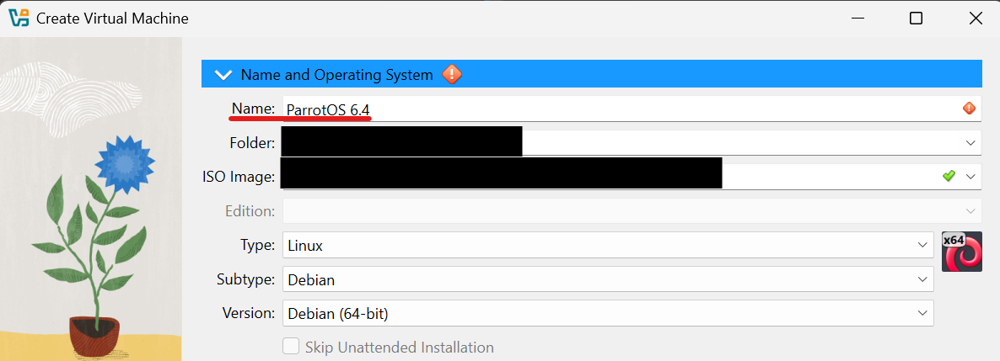
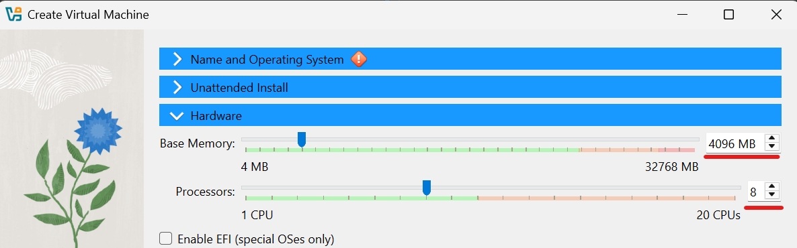
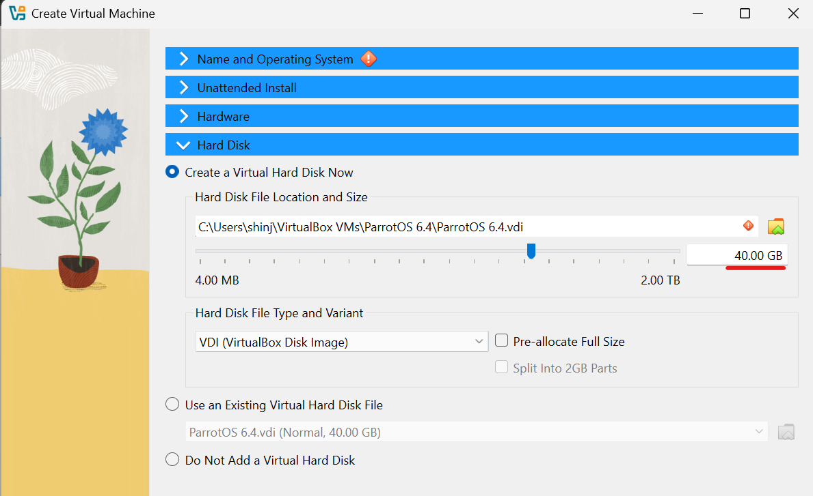

# About Attack Virtual Machine

Although Kali is more popular than ParrotOS, I select ParrotOS. The reason is that, as Kali is frequently updated, the system or user interface may be changed significantly.  

## Make ParrotOS Virtual Machine
1. Access to the official ParrotOS site
1. Download ParrotOS Security Edition iso image  
[ParrotOS-SecurityEdition](https://parrotsec.org/download/)
1. Creat Virtual Machine from VirtualBox
    * Input the name (Note: Recommend to include the OS version)
    
    * Set the hardware  
    Main memory: 4096 MB  
    Processors: 8
    
    * Set the hard disk  
    Hard disk size: 40 GB  
    

## Set Configuration of ParrotOS Virtual Machine
