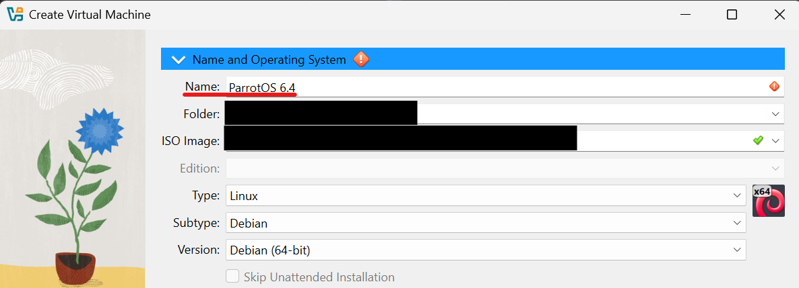
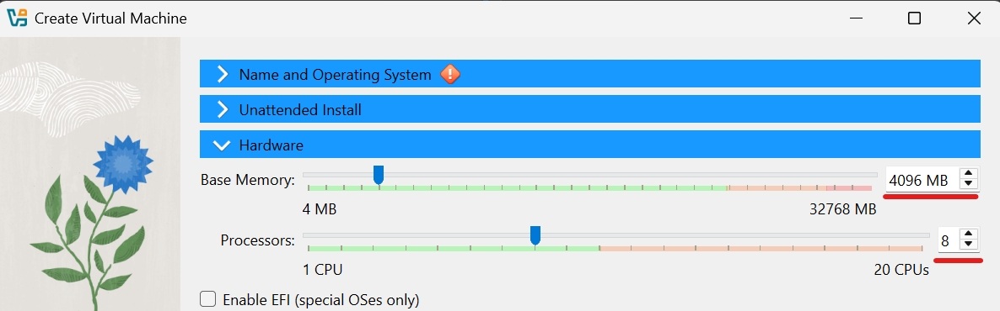
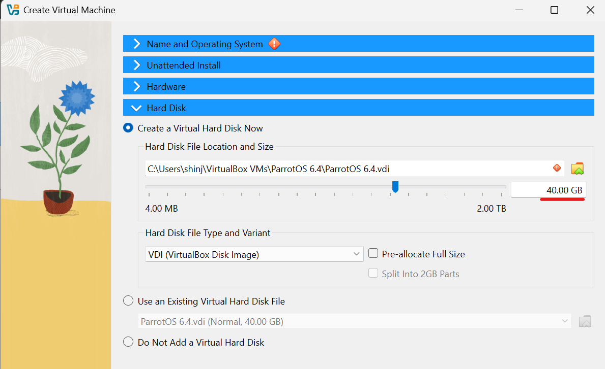
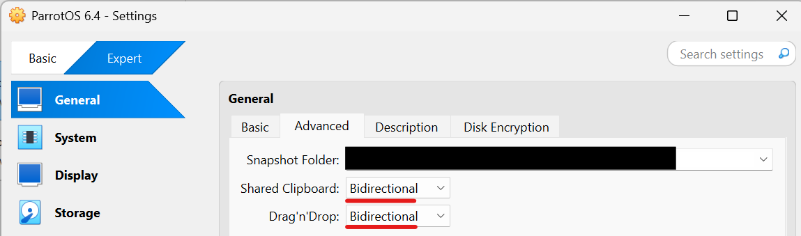
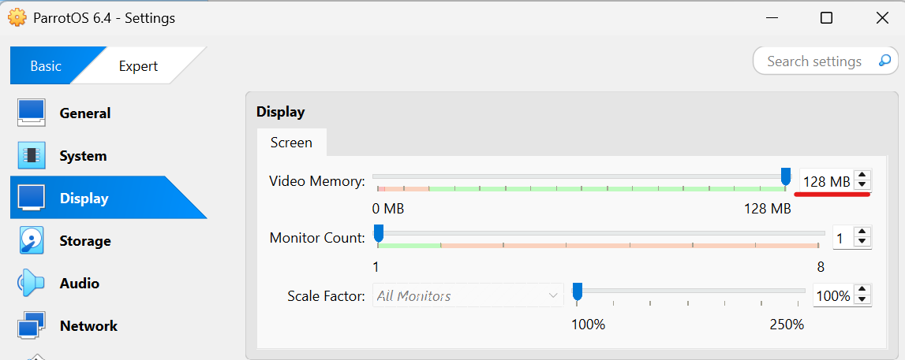
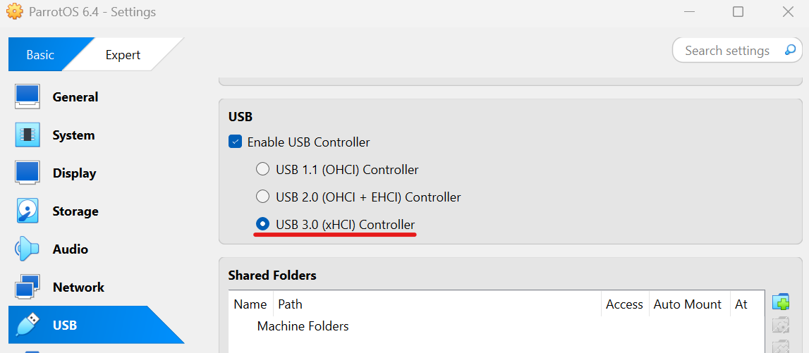
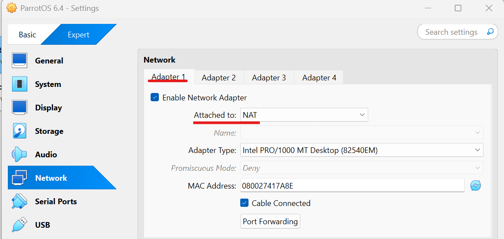
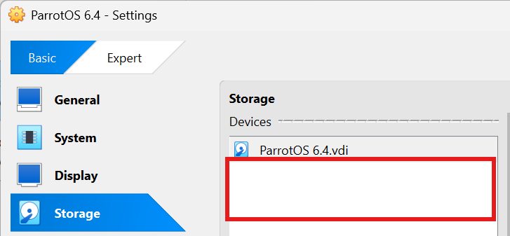
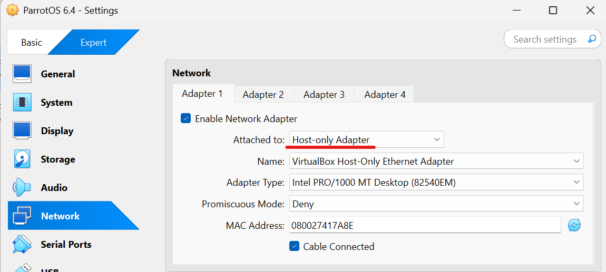

# About Attack Virtual Machine

Although Kali is more popular than ParrotOS, I select ParrotOS. The reason is that, as Kali is frequently updated, the system or user interface may be changed significantly.  

## Make ParrotOS Virtual Machine
1. Access to the official ParrotOS site and download ParrotOS Security Edition iso image  
[ParrotOS-SecurityEdition](https://parrotsec.org/download/)

1. Creat Virtual Machine from VirtualBox
    * Input the name (Note: Recommend to include the OS version)
    
    * Set the hardware  
    Main memory: 4096 MB  
    Processors: 8
    
    * Set the hard disk  
    Hard disk size: 40 GB  
    

## Set Configuration of ParrotOS Virtual Machine
1. Enable copy and paste
    * Shared Clipboard: Bidirectional
    * Drag'n'Drop: Bidirectional
    

1. Increase video memory
    * Video memory: 128 MB
    

1. Enable USB 3.0
    * Select USB 3.0 (xHCI) Controller
      

1. Enable Network Adapter
    * Attached to: **NAT (Not NAT Network)** in the Adapter 1
    
    * Adapter 2, 3, 4 are not to set  

## Install ParrotOS to the Empty Virtual Machine
1. Start ParrotOS machine from the VirtualBox

1. Install ParrotOS

1. Shutdown the system

1. Remove the ISO file from the storage
    * As there is a iso file in the red part, you remove the file.
    

## Preparing for attacking
1. Enable John the Ripper  
    Add a PATH in the shell profile  
    * Input the following command in the terminal  
        `vi ~/.bashrc`  
    * Add the following sentence in the last row  
        `export PATH=$PATH:/usr/sbin`
    * Reload the shell configuration  
        `source ~/.bashrc`

1. Extract rockyou.txt.gz file from the terminal  
    `gunzip /usr/share/wordlists/rockyou.txt.gz`

1. Download Password List for Hydra  
    Download page: https://github.com/danielmiessler/SecLists/tree/master/Passwords/Common-Credentials  
    `unzip SecLists-mater.zip`  

1. Install FTP command  
    `sudo apt update`  
    `sudo apt install ftp`  

1. Install Droopescan  
    `python3 -m venv myenv`  
    `source myenv/bin/activate`  
    `pip install droopescan`  

1. Install CeWL  
    `git clone https://github.com/digininja/CeWL`  
    `cd CeWL`  
    `sudo gem install bundler`  
    `bundle install`  
    `chmod u+x ./cewl.rb`  

1. Install LinPEAS  
    Access to the `https://github.com/peass-ng/PEASS-ng/releases`  
    Download the "linpeas.sh" file  

1. Install WPScan  
    `sudo gem install wpscan`  
    `wpscan --update`  

1. Install droopescan  
    `sudo apt install pipx -y`  
    `pipx install droopescan`  
    Go to the installed directory of droopescan (My case: ~/.local/pipx/venvs/droopescan/bin)  
    `pipx ensurepath`  

## Change Network Adapter Setting
1. Network adapter setting from NAT to **Host-only Adapter**  
    * Since the host-only adapter can communicate within the virtual network, no damage occurs even if the machine attempts to attack a public service machines.  
    Although the Host-only adapter cannot communicate with the public network, each virtual machine can communicate with each others.
      
    