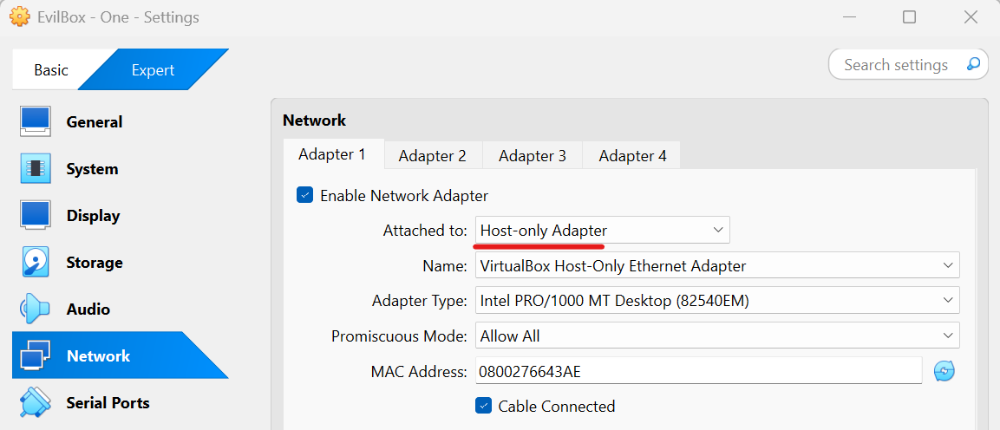
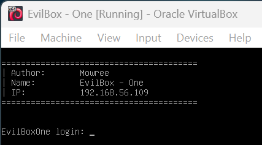
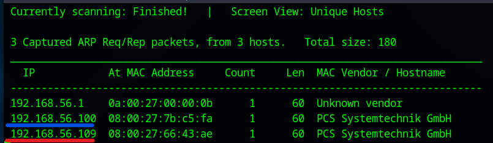

# EvilBox:One Walkthrough

## Preparation
1. Download EvilBox.ova file ([EvilBox.ova](https://download.vulnhub.com/evilbox/EvilBox---One.ova))

1. Import the OVA file in the VirtualBox

1. Set the network adapter to Host-only Adapter
    * Attached to: **Host-only Adapter**
        

1. Start the EvilBox virtual machine
    * Turn on the EvilBox virtual machine from the VirtualBox  
      

1. Confirm the IP address of the EvilBox virtual machine from the attack virtual machine  
    * `sudo netdiscover -i enp0s3 -r 192.168.56.0/24`  
      
      
        * 192.168.56.100: DHCP Server
        * **192.168.56.109**: EvilBox Server

1. Set the EvilBox IP address to the environment variance  
    * `export IP=192.168.56.109`  