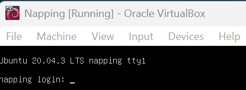
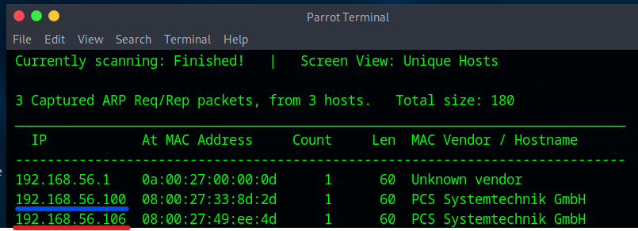
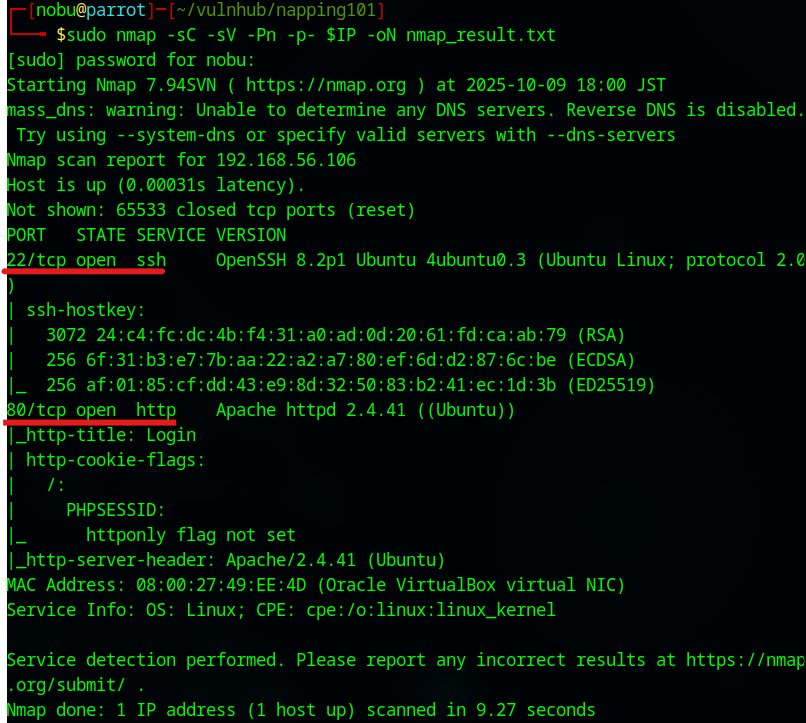

# NAPPING: 1.0.1 Walkthrough

## Preparation
1. Download Napping-1.0.1.ova file ([Napping-1.0.1.ova](https://download.vulnhub.com/napping/napping-1.0.1.ova))

1. Import the OVA file in the VirtualBox

1. Set the network adapter to Host-only Adapter
    * Attached to: **Host-only Adapter**
    

1. Start the Napping-1.0.1 virtual machine
    * Turn on the Napping-1.0.1 virtual machine from the VirtualBox  
      

1. Confirm the IP address of the Napping-1.0.1 virtual machine from the attack virtual machine  
    * `sudo netdiscover -i enp0s3 -r 192.168.56.0/24`  
      
      
        * 192.168.56.100: DHCP Server
        * **192.168.56.106**: Napping-1.0.1 Server

1. Set the Napping-1.0.1 IP address to the environment variance  
    * `export IP=192.168.56.106`  

## Reconnaissance
1. Do portscan using Nmap  
    * `sudo nmap -sC -sV -Pn -p- $IP -oN nmap_result.txt`  
    
        * -sC: Scan with default script
        * -sV: Show software name and the version
        * -Pn: Do not confirm communication before port scan (We have already confirmed the Napping-1.0.1 IP address.)
        * -p-: Scan all ports (from 0 to 65535 ports)
        * -oN: Output the scan results to the specified file

1. As we see the nmap result, we can attempt to access of 22 (SSH Service) and 80 (Http Service) ports.  
