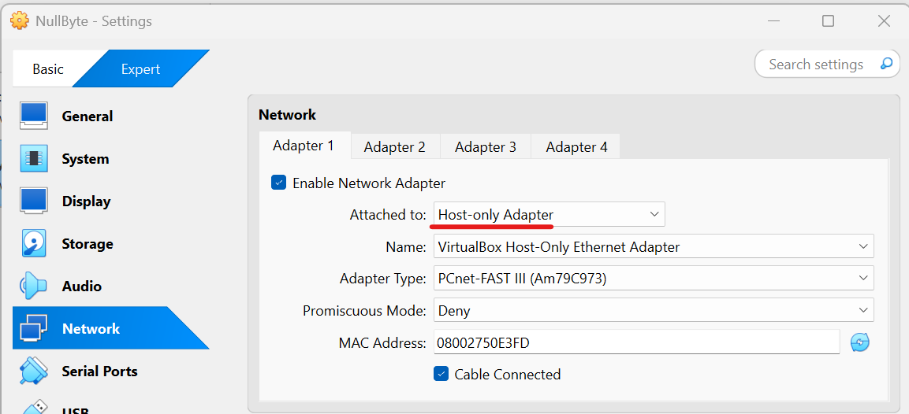
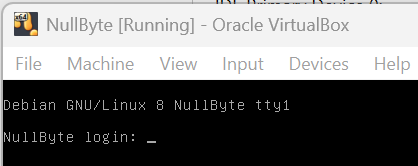
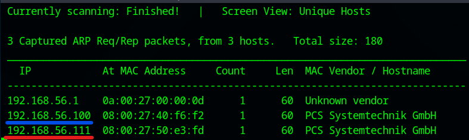
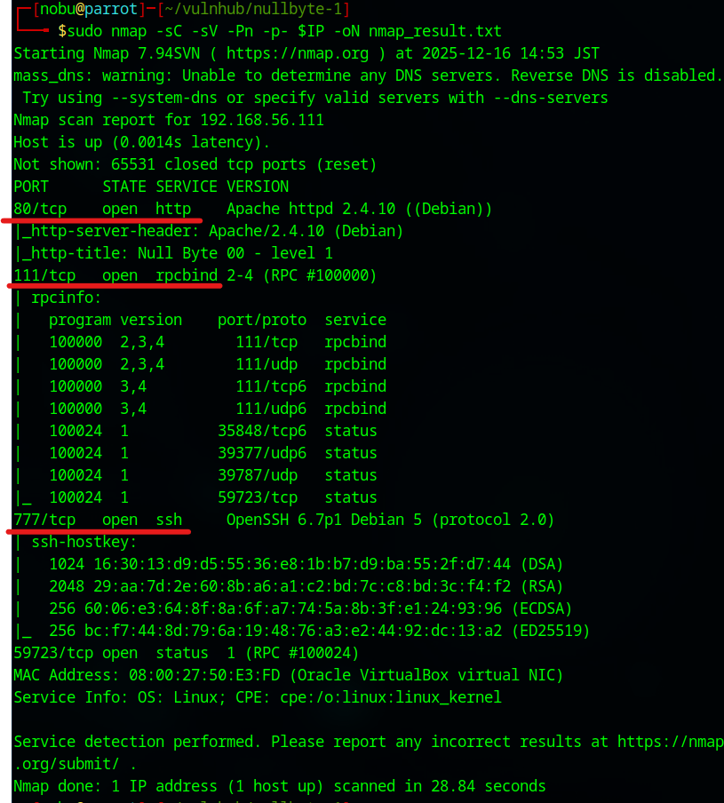
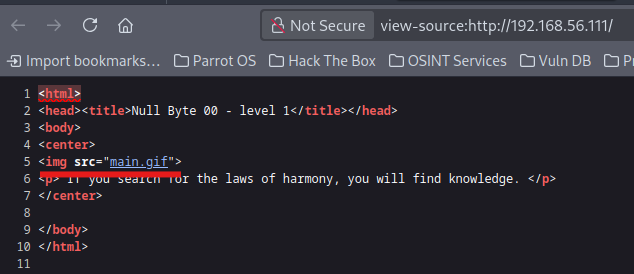
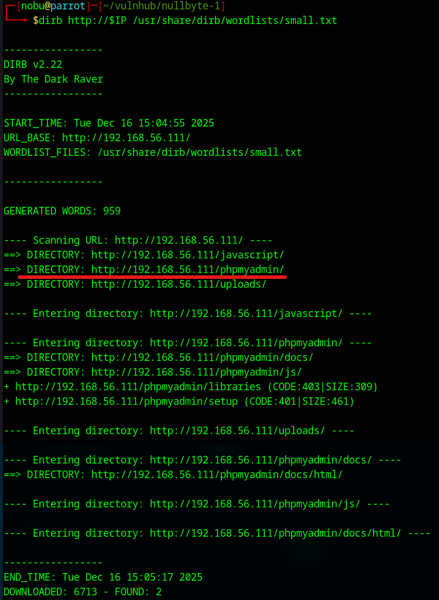
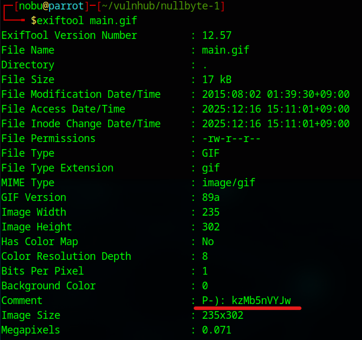
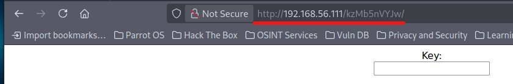

# NullByte: 1 Walkthrough

## Preparation
1. Download NullByte.ova.zip file ([NullByte.ova.zip](https://download.vulnhub.com/nullbyte/NullByte.ova.zip))

1. Extract the .zip file  

1. Move the extracted folder to the VM's folder  

1. Add the NullByte.ova file in the VirtualBox

1. Set the network adapter to Host-only Adapter
    * Attached to: **Host-only Adapter**
        

1. Start the NullByte1 virtual machine
    * Turn on the NullByte1 virtual machine from the VirtualBox  
      

1. Confirm the IP address of the NullByte1 virtual machine from the attack virtual machine  
    * `sudo netdiscover -i enp0s3 -r 192.168.56.0/24`  
      
      
        * 192.168.56.100: DHCP Server
        * **192.168.56.111**: NullByte1 Server  

1. Set the VulnOS2 IP address to the environment variance  
    * `export IP=192.168.56.111`  

## Reconnaissance
1. Do portscan using Nmap  
    * `sudo nmap -sC -sV -Pn -p- $IP -oN nmap_result.txt`  
      
        * -sC: Scan with default script
        * -sV: Show software name and the version
        * -Pn: Do not confirm communication before port scan (We have already confirmed the DC-2 IP address.)
        * -p-: Scan all ports (from 0 to 65535 ports)
        * -oN: Output the scan results to the specified file
    * As we see the nmap result, we can attempt to access of 80 (HTTP Service), 111 (RPCBIND Service), and 777 (SSH Service) ports.  

1. Access to the HTTP Service  
    * Access with Web browser  
      
        - `http://192.168.56.111/`  
        - There is a suspicous .gif file in the view-source page  

1. Enumerate accessible files  
    * Use the DIRB  
      
        - `dirb http://$IP /usr/share/dirb/wordlists/small.txt`  

1. Investigate the image file  
    * Download the "main.gif" file  
        - `wget http://$IP:80/main.gif`  
    * Use exiftool command  
      
        - `exiftool main.gif`  

1. Access the suspicious page  
    * Assume the "kzMb5nVYJw" is directory and access to it  
      
        - It demands to input a key  