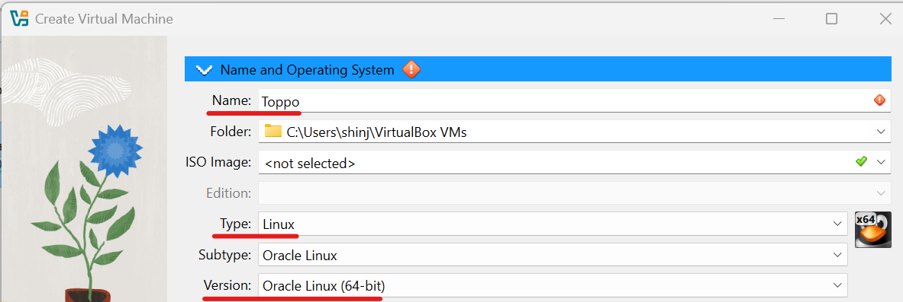
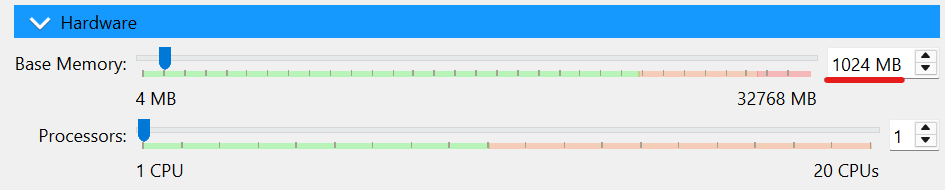
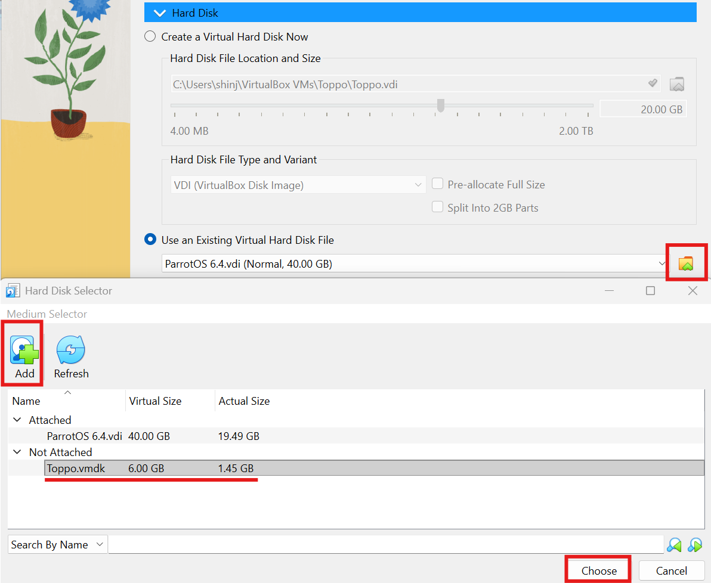
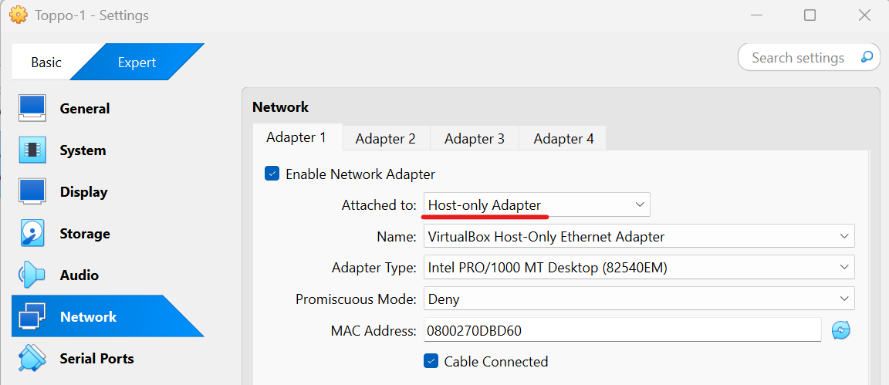
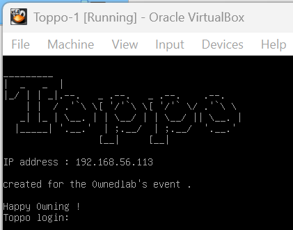
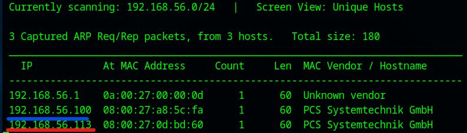

# Toppo: 1 Walkthrough

## Preparation
1. Download Toppo.zip file ([Toppo.zip](https://download.vulnhub.com/toppo/Toppo.zip))

1. Extract the zip file  

1. Make the virtual machine  
    * Setting the following items  
      
      
      
        - Machine -> New  
        - Name: Toppo-1  
        - Type: Linux  
        - Version: Oracle Linux (64-bit)  
        - Base Memory: 1024 MB  
        - Choose "Toppo.vmdk (extracted file)  

1. Set the network adapter to Host-only Adapter
    * Attached to: **Host-only Adapter**
        

1. Start the Toppo-1 virtual machine
    * Turn on the mrRobot virtual machine from the VirtualBox  
      

1. Confirm the IP address of the Toppo-1 virtual machine from the attack virtual machine  
    * `sudo netdiscover -i enp0s3 -r 192.168.56.0/24`  
      
      
        * 192.168.56.100: DHCP Server
        * **192.168.56.113**: Toppo-1 Server  

1. Set the Toppo-1 IP address to the environment variance  
    * `export IP=192.168.56.113`  