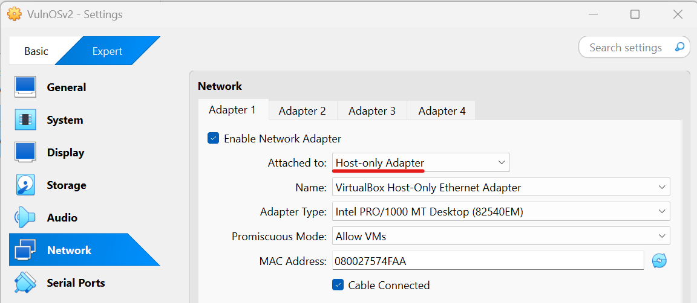
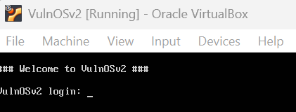
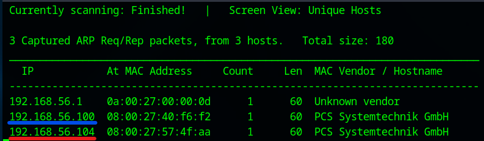
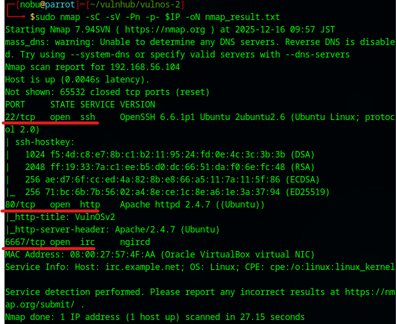
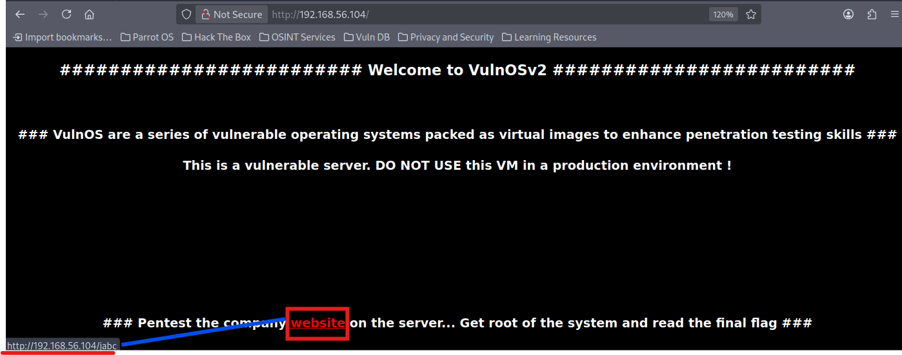
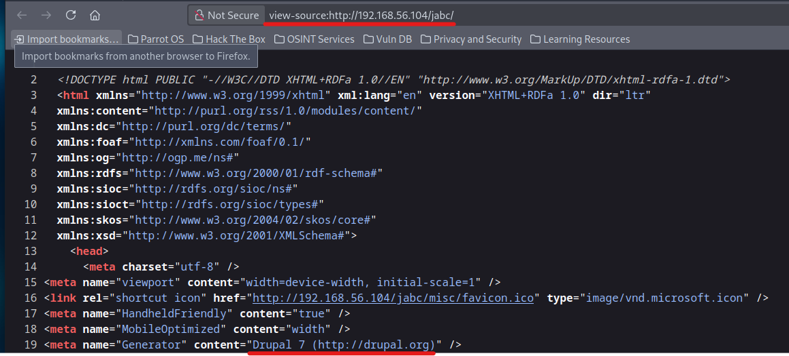
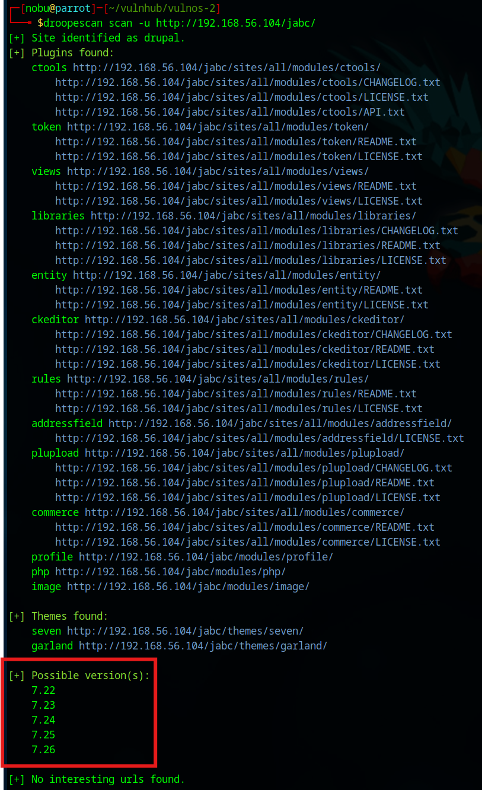

# VulnOS: 2 Walkthrough

## Preparation
1. Download VulnOS2.z file ([VulnOS2.z](https://download.vulnhub.com/vulnos/VulnOSv2.7z))

1. Extract the .z file  

1. Move the extracted folder to the VM's folder  

1. Add the VulnOSv2.box file in the VirtualBox

1. Set the network adapter to Host-only Adapter
    * Attached to: **Host-only Adapter**
        

1. Start the VulnOS2 virtual machine
    * Turn on the VulnOS2 virtual machine from the VirtualBox  
      

1. Confirm the IP address of the VulnOS2 virtual machine from the attack virtual machine  
    * `sudo netdiscover -i enp0s3 -r 192.168.56.0/24`  
      
      
        * 192.168.56.100: DHCP Server
        * **192.168.56.104**: VulnOS2 Server

1. Set the VulnOS2 IP address to the environment variance  
    * `export IP=192.168.56.104`  

## Reconnaissance
1. Do portscan using Nmap  
    * `sudo nmap -sC -sV -Pn -p- $IP -oN nmap_result.txt`  
      
        * -sC: Scan with default script
        * -sV: Show software name and the version
        * -Pn: Do not confirm communication before port scan (We have already confirmed the DC-2 IP address.)
        * -p-: Scan all ports (from 0 to 65535 ports)
        * -oN: Output the scan results to the specified file
    * As we see the nmap result, we can attempt to access of 22 (SSH Service), 80 (HTTP Service), and 6667 (IRC Service) ports.  

1. Access to the 80 port  
    * Access with Web browser  
      
      
        - The page may be structured by Drupal 7  

1. Scan the web page  
    * Use droopescan  
      
        - `droopescan scan -u http://192.168.56.104/jabc/`  
        - The Drupal version: 7.22 ~ 7.26  
